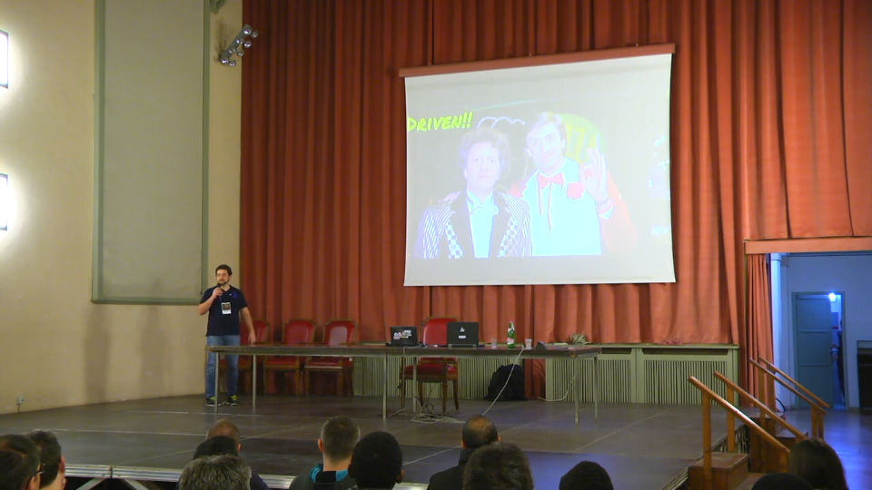

[TDD a piccoli passi](http://www.agileday.it/front/sessions/4888/)

**Evento**: [Italian Agile Days 2016 - Pavia](http://www.agileday.it/2016/)
**Luogo**: Pavia, Italia
**Argomento**: Test-Driven Development
**Risorse**:
- [Feedback](https://joind.in/event/iad16---italian-agile-days-2016/tdd-a-piccoli-passi)
- [Slides](https://www.slideshare.net/FerdinandoSantacroce/tdd-a-piccoli-passi)
- [Repository GitHub](https://github.com/jesuswasrasta/SmallStepsTDD)