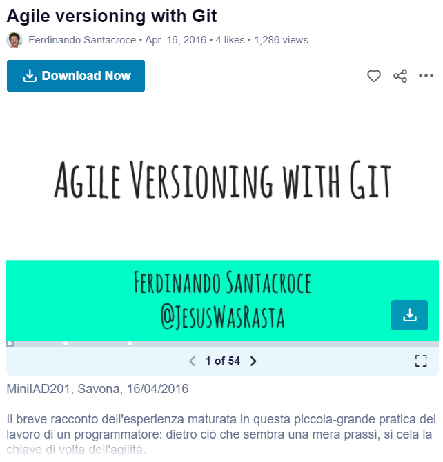

Agile versioning with Git

**Event**: [Mini Italian Agile Day, Savona, 2016](http://www.agileday.it/mini/2016/savona/)
**Location**: Savona, Italy
**Topic**: Git versioning in agile environments
**Resources**: [Slides](https://www.slideshare.net/FerdinandoSantacroce/agile-versioning-with-git-60998779)