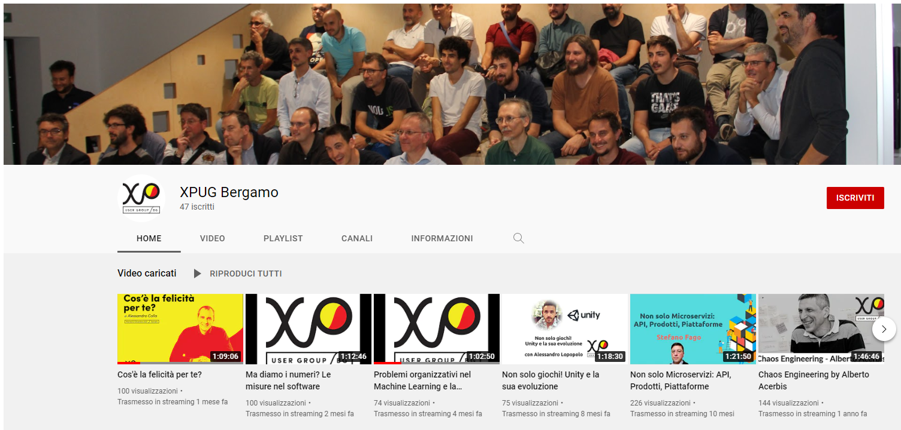

Testare l'intestabile

**Event**: [eXtreme Programming User Group Bergamo](https://xpugbg.it/)
**Location**: Bergamo, Italy
**Topic**: Workshop on legacy code testing
**Resources**:
- [Recap on XPUGBG blog](https://xpugbg.it/blog/meetup-workshop-testare-l-intestabile-ferdinando-santacroce-resoconto/)
- [Slides](https://www.slideshare.net/FerdinandoSantacroce/testare-lintestabile-workshop-xpugbg)
- [Trivia Kata in Java](https://github.com/jesuswasrasta/trivia-java)