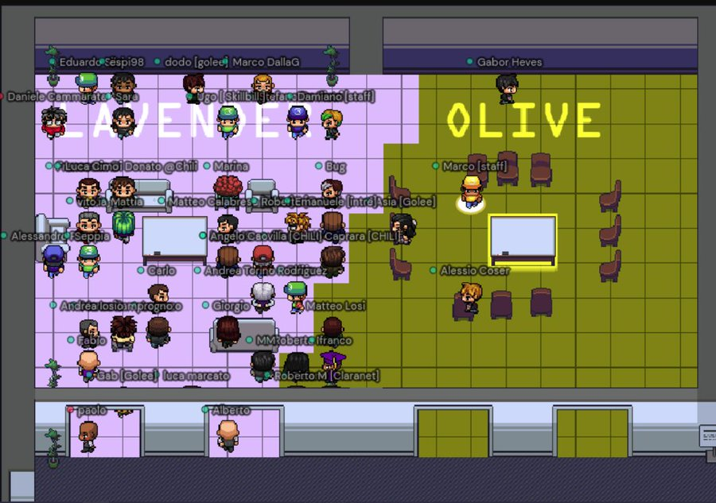
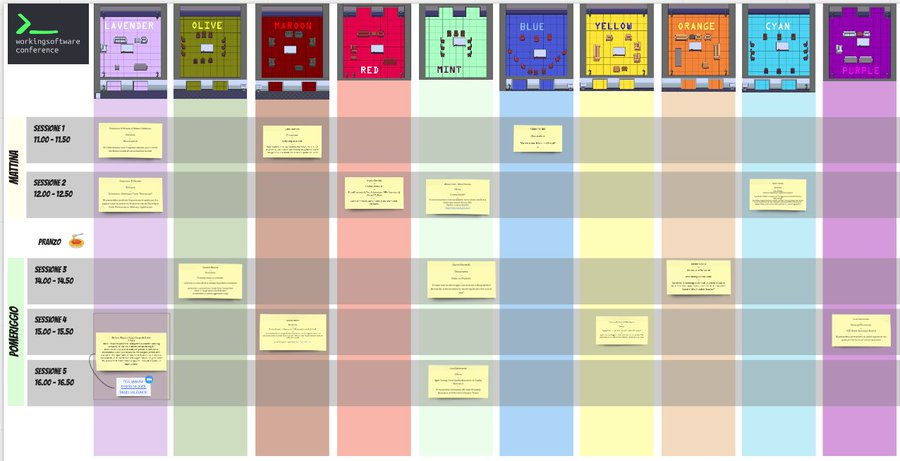

I was the organizer of the remote edition of Working Software Conference.

**Event**: [Working Software Conf 2021 - remote edition](https://www.agilemovement.it/workingsoftware/)
**Location**: Italy (Online)
**Role**: Conference organizer
**Format**: Remote conference