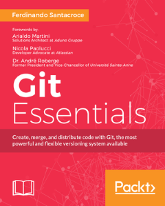

Some time ago I wrote a book for [Packt Publishing](https://www.packtpub.com/) about *Git*.

[Git Essentials](https://www.packtpub.com/application-development/git-essentials).

The book has been included in [Git Survey 2016](https://git.wiki.kernel.org/index.php/GitSurvey2016), gaining the [3rd place](https://survs.com/report/nz2odu1spl) (light-years behind [Pro Git](https://git-scm.com/book/en/v2), of course :sweat_smile:).
