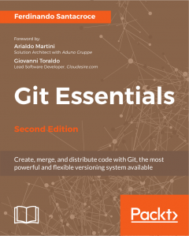

Scrivere la prima edizione mi è piaciuto molto e ho imparato tanto. Così ho deciso di scriverlo di nuovo :smiley:

[Git Essentials, 2nd Edition](https://www.packtpub.com/application-development/git-essentials-second-edition).

Anche questa volta il libro è stato apprezzato.

Il libro è stato tradotto in italiano da Apogeo:

[Git - Guida per imparare a gestire, distribuire e versionare codice](https://www.apogeonline.com/libri/git-ferdinando-santacroce/).

