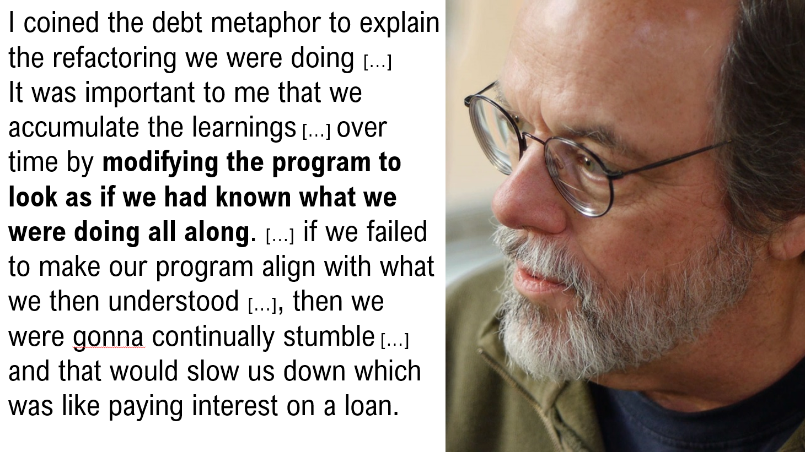
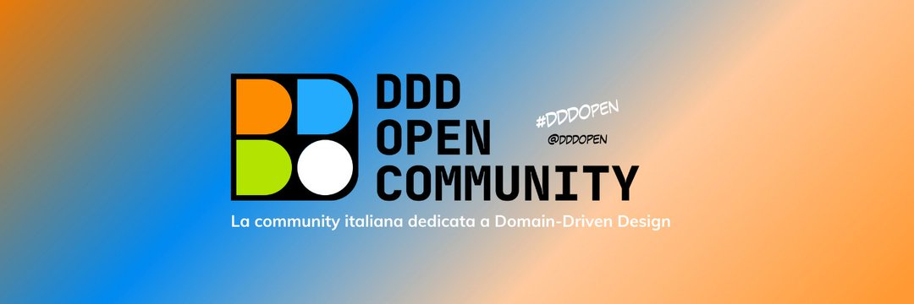
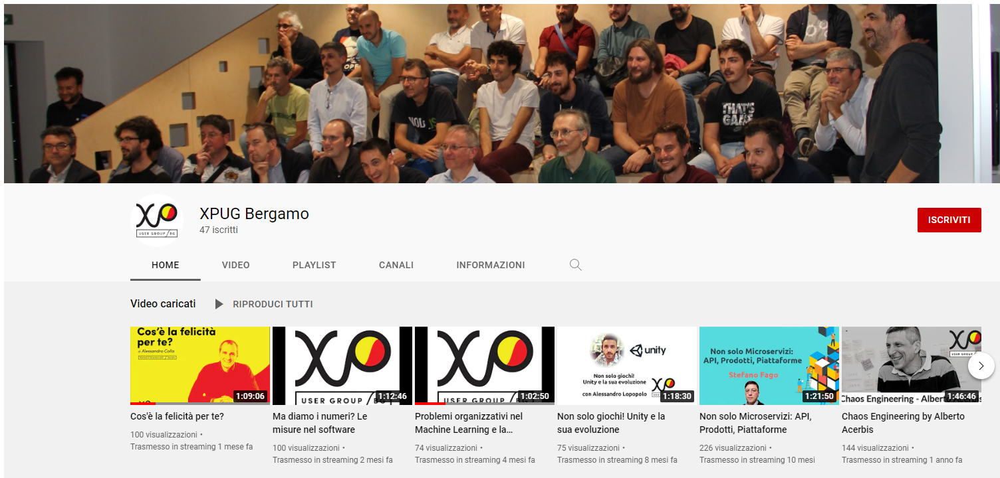

Here a brief list of my public appearances :blush:

## 2023
### :it: [Italian Agile Days](https://www.agileday.it/){:target="_blank"}
Talking about user stories, technical debt, domain driven design, models and reality... 💭
{:target="_blank"}

### :it: [Reloaded Podcast](https://open.spotify.com/show/0wryeBJ9AzUBPDX6mJN2yC?si=2e0f142286284226){:target="_blank"}
In this episode, I tell something about the story of the story points, their use and, suddenly, their abuse... 😄
{:target="_blank"}

## 2022
### :it: [Italian Agile Days](https://www.agileday.it/){:target="_blank"}
A nice story about coal miners and software development 😏
{:target="_blank"}

### :it: [TDD Milano Meetup](https://www.meetup.com/it-IT/TDD-Milano/events/){:target="_blank"}
An in presence workshop on refactoring; a little challenge, a lot of fun 😄
{:target="_blank"}
[Miro board](https://miro.com/app/board/uXjVOJrieKg=/){:target="_blank"}  
[Github repo with directions](https://github.com/jesuswasrasta/refactoring-showdown)  

### :it: [Agile Reloaded Meetup](https://www.meetup.com/it-IT/agile-reloaded-italia/){:target="_blank"}
[Assessment tecnico di un team di sviluppo](https://www.meetup.com/it-IT/agile-reloaded-italia/events/284308349/){:target="_blank"}      
Smalltalk about tools and approaches to assess development teams.
{:target="_blank"}    
_Assessment tecnico di un team di sviluppo - Miro board_

### :it: [Agile Lean Tuscany](https://www.meetup.com/it-IT/ALT-AGILE-LEAN-TUSCANY/){:target="_blank"}
{:target="_blank"}  
_Intervista con Andrea Gelli - Video_

## 2021
### :it: [KLab Community](https://www.meetup.com/it-IT/KLab-Community/){:target="_blank"}
[Rendimi agile, ma non subito](https://www.meetup.com/it-IT/KLab-Community/events/281541073/){:target="_blank"}  
{:target="_blank"}    
_Rendimi agile, ma non subito - Video_

### :it: [Italian Agile Days](https://www.agileday.it/){:target="_blank"}
{:target="_blank"}      
_Agile Testing Matrix - Miro board_

{:target="_blank"}    
_Italian Agile Days 2021 - Agile Testing Matrix - Video_

### :it: [DDDOpen](https://www.linkedin.com/company/ddd-open){:target="_blank"}
I'm one of the co-founder of DDDOpen community :blush:  
{:target="_blank"}  

### :it: [Working Software Conf 2021 - remote edition](https://www.agilemovement.it/workingsoftware/){:target="_blank"}
{:target="_blank"}  
_Working Software Conf 2021 - GatherTown space_

{:target="_blank"}    
_Working Software Conf 2021 - Miro board_

## 2020
### :it: [TomorrowDevs](https://www.youtube.com/channel/UCckCYs-msiC4Vs_nyg218Hw){:target="_blank"}
Storie di developers - intervista con Simone Torrisi  
  
{:target="_blank"}  
_Storie di developers - intervista con Simone Torrisi - Video_

### :it: [TDD Milano Meetup](https://www.meetup.com/it-IT/TDD-Milano){:target="_blank"}  
[Mining Code Repositories meetup event](https://www.meetup.com/it-IT/TDD-Milano/events/273031114/){:target="_blank"}  
[Slides](https://docs.google.com/presentation/d/1EbqhJNjNU2hNCj1GluP7OG6In3wdLf2U74T4wrkhOxo/edit?usp=sharing){:target="_blank"}  

{:target="_blank"}  
_TDD Milano Meetup, 2020 - Mining Code Repositories - Video_

### :it: [Agile Venture Milano](https://www.agilemovement.it/venture/2020/milano/){:target="_blank"}  
Growing Teams talk :movie_camera: :it:  
[Slides](https://www.slideshare.net/FerdinandoSantacroce/growing-teams-152158846){:target="_blank"} :uk:  

{:target="_blank"}  
_Agile Venture Milano 2020 - Growing Teams - Video_

## 2019
### :it: [Italian Agile Days Modena](https://www.agileday.it/){:target="_blank"}  
Testare l'intestabile, workshop on legacy code  
[Slides](https://www.slideshare.net/FerdinandoSantacroce/testare-lintestabile-italian-agile-days-2019-iad19){:target="_blank"}  
[Trivia Kata in Java](https://github.com/jesuswasrasta/trivia-java){:target="_blank"}  

### :it: [Agile Venture Firenze](https://www.agilemovement.it/venture/2019/firenze/){:target="_blank"}  
Testare l'intestabile, workshop on legacy code  
[Slides](https://www.slideshare.net/FerdinandoSantacroce/testare-lintestabile-workshop-agile-venture-firenze){:target="_blank"}  
[Trivia Kata in Java](https://github.com/jesuswasrasta/trivia-java){:target="_blank"}  
[Podcast interview](https://www.spreaker.com/user/10553302/intervista-ferdinandosantacroce-avfi) by [Officina Agile](https://www.officinaagile.it/)  

### :it: [eXtreme Programming User Group Bergamo](https://xpugbg.it/){:target="_blank"}  
Testare l'intestabile, workshop on legacy code
[Recap on XPUGBG blog](https://xpugbg.it/blog/meetup-workshop-testare-l-intestabile-ferdinando-santacroce-resoconto/){:target="_blank"}  
[Slides](https://www.slideshare.net/FerdinandoSantacroce/testare-lintestabile-workshop-xpugbg){:target="_blank"}  
[Trivia Kata in Java](https://github.com/jesuswasrasta/trivia-java){:target="_blank"}  

{:target="_blank"}  
_XPUGBG video channel_

### :it: [Working Software Conf](https://www.agilemovement.it/workingsoftware/){:target="_blank"}  
I've been the chair of this great... GREAT event! :blush:   

{:target="_blank"}  
_Working Software Conf 2019 - Intro - Video_

{:target="_blank"}  
_Working Software Conf 2019 - All the videos_

### :it: [Radio24, intervista](http://www.radio24.ilsole24ore.com/programma/i-lavori-di-domani/){:target="_blank"}  
{:target="_blank"}    

### :it: [Meetup Agile Reloaded](https://www.meetup.com/it-IT/Agile-Reloaded-Meetup/){:target="_blank"}  
[Slides](https://www.slideshare.net/FerdinandoSantacroce/growing-teams-152158846){:target="_blank"} :uk:  
{:target="_blank"}  
_Meetup Agile Reloaded - Growing Teams_

### :uk: [Agile Venture Bolzano](https://www.agilemovement.it/venture/2019/bolzano/){:target="_blank"}  
[I'm a mediocre developer on Sessionize](https://sessionize.com/s/ferdinando-santacroce/im_a_mediocre_developer/23243){:target="_blank"}  
[Slides](https://www.slideshare.net/FerdinandoSantacroce/im-a-mediocre-developer-167929970){:target="_blank"} :uk:  

_Agile Venture Bolzano 2019 - I'm a mediocre developer_
 
### :it: [Meetup XPUG Milano](https://www.meetup.com/it-IT/Milano-eXtreme-Programming-User-Group){:target="_blank"}  
 [Panel: qual è lo stato attuale di eXtreme Programming?](https://www.meetup.com/it-IT/Milano-eXtreme-Programming-User-Group/events/260548356/){:target="_blank"}  
{:target="_blank"}  
_Meetup XPUG Milano - Panel: qual è lo stato attuale di eXtreme Programming?_

### :it: [Meetup FEVR - Verona](http://www.fevr.it){:target="_blank"}  
[I'm a mediocre developer - FEVR event](http://www.fevr.it/eventi/2019/03/im-a-mediocre-developer/){:target="_blank"}  
{:target="_blank"}  
_Meetup FEVR - Verona - Sono uno sviluppatore mediocre - Video_

## 2018
### :it: [Italian Agile Days 2018 - Brescia](https://www.agileday.it){:target="_blank"}  
 * [I'm a mediocre developer](https://www.agileday.it/front/sessions/im-a-mediocre-developer/){:target="_blank"}
  * [Feedback](https://www.linkedin.com/feed/update/urn:li:activity:6479380811970801664){:target="_blank"}
  * [Slides](https://www.slideshare.net/FerdinandoSantacroce/im-a-mediocre-developer){:target="_blank"} :it:
  * [Sono uno sviluppatore mediocre](http://www.mokabyte.it/2018/11/sviluppatoremediocre/){:target="_blank"} :it:

{:target="_blank"}  
_Italian Agile Days 2018 - Brescia - I'm a mediocre developer - Video_

### :it: [Agile Venture Prato](https://www.agileday.it/mini/2018/prato/){:target="_blank"}  
Objects Calisthenics Workshop
  * [Slides](https://www.slideshare.net/FerdinandoSantacroce/object-calisthenics-agile-venture-prato-2018){:target="_blank"}
  * [Tennis Refactoring Kata](https://github.com/jesuswasrasta/Tennis-Refactoring-Kata){:target="_blank"}

{:target="_blank"}  
_Agile Venture Prato 2018 - Objects Calisthenics Workshop_

### :it: :uk: [Milan Kotlin Community Conf 2018](https://www.agilemovement.it/kotlincommunityconf/milan/){:target="_blank"}  
* I've been thee chair of the 1st one-day conference about Kotlin here in Italy :smiley:  
{:target="_blank"}  
_Milan Kotlin Community Conf 2018 - all the videos_

### :it: [Torino Agile Conference 2018](https://www.agileday.it/mini/2018/torino/#ferdinandosantacroce){:target="_blank"}  
* **Objects Calisthenics Workshop**
  * [TicTacToe kata repo](https://github.com/jesuswasrasta/TicTacToe){:target="_blank"}

### :it: [TDD Milano Meetup](https://www.meetup.com/it-IT/TDD-Milano){:target="_blank"}  
* [Git Essentials Workshop](https://www.meetup.com/it-IT/TDD-Milano/events/245383610/){:target="_blank"}
* [Object Calisthenics Workshop](https://www.meetup.com/it-IT/TDD-Milano/events/247937838/){:target="_blank"}
  * [Slides](https://www.slideshare.net/FerdinandoSantacroce/object-calisthenics-tdd-milano){:target="_blank"}
  * [Farkle kata repo](https://github.com/jesuswasrasta/KataFarkle){:target="_blank"}

## 2017
In 2017 I focused on organizing events, rather than participating as a speaker :blush:  

### :it: [Italian Agile Movement](http://www.agilemovement.it/)
* I've been elected as advisor. I help organizing [Italian Agile Days](http://www.agileday.it/){:target="_blank"} and many other conferences all around Italy.

## 2016
### :it: [Italian Agile Days 2016 - Pavia](http://www.agileday.it/2016/){:target="_blank"}
* [TDD a piccoli passi](http://www.agileday.it/front/sessions/4888/){:target="_blank"}
  * [Feedback](https://joind.in/event/iad16---italian-agile-days-2016/tdd-a-piccoli-passi){:target="_blank"}
  * [Slides](https://www.slideshare.net/FerdinandoSantacroce/tdd-a-piccoli-passi){:target="_blank"}
  * [GitHub repo](https://github.com/jesuswasrasta/SmallStepsTDD){:target="_blank"}

{:target="_blank"}  
_Italian Agile Days 2016 - Pavia - TDD a piccoli passi_

### :it: [Mini Italian Agile Day, Savona, 2016](http://www.agileday.it/mini/2016/savona/){:target="_blank"}
{:target="_blank"}  
_Agile versioning with Git - Savona - 2016_
