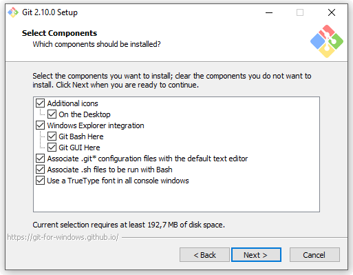
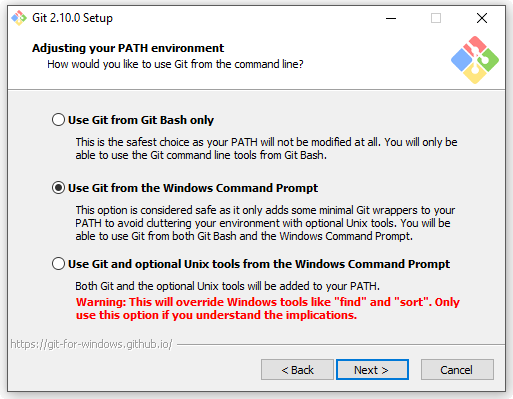
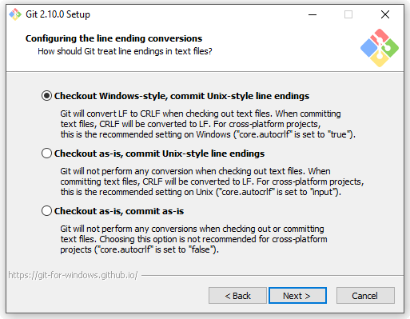
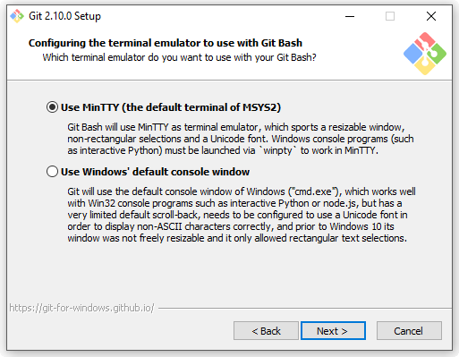
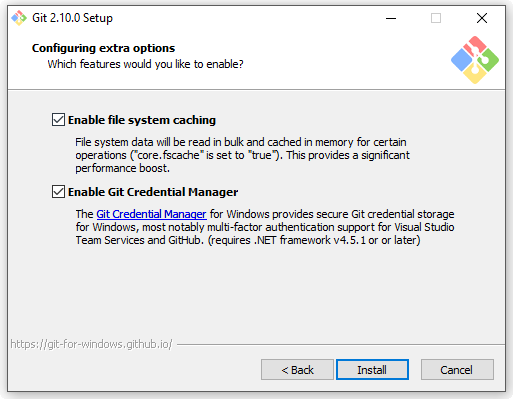
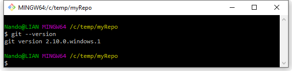
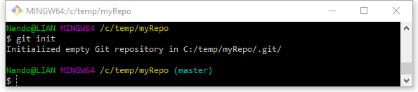
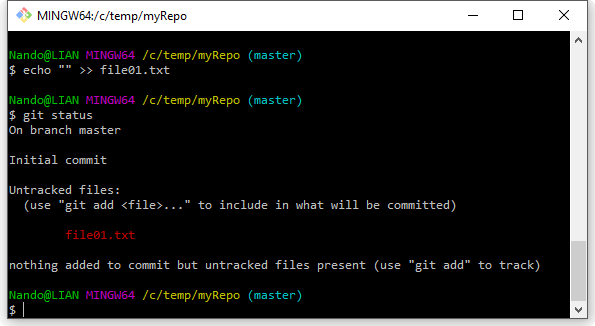
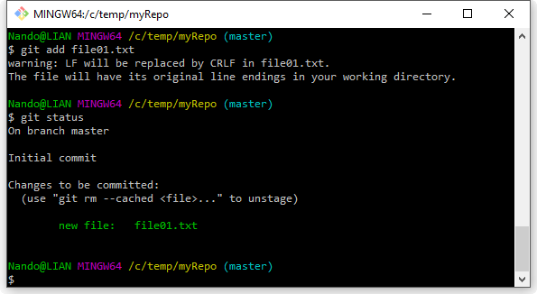
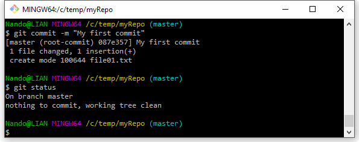

## Distributed vs Centralized

Nella scorsa puntata abbiamo visto come, da una situazione di emergenza, sia venuto alla luce Git, uno strumento destinato a rivoluzionare il mondo dei **Distributed Version Control Systems (DVCS)**.

Prima di continuare, spendiamo un po’ di tempo per capire le differenze principali fra i sistemi distribuiti e quelli centralizzati, ovvero i **Centralized Version Control Systems (CVCS)**.

A dire il vero, i sistemi che per primi si sono affacciati sulla scena non erano né centralizzati, né distribuiti. Il primo sistema di versionamento che possiamo citare è**Source Code Control System** (SCCS) [1] datato 1972, considerato il nonno di tutti i sistemi di versionamento. Esso era stato messo a punto esplicitamente per tenere traccia delle modifiche fatte a file contenenti codice, ed era fatto per funzionare localmente. L’integrità delle modifiche era garantita da dei semplici quanto robusti lock sui file: un file poteva essere editato da una sola persona per volta. Lo stesso dicasi per **Revision Control System**(RCS) [2] classe 1982, anch’esso focalizzato sulla gestione delle versioni dei singoli file tramite lock.

Ciò che accomuna questi sistemi di versionamento “**di prima generazione**” è il fatto che la versione o revisione è legata al singolo file, e non a quello che noi oggi chiamiamo comunemente **commit**; è solo con la “**seconda generazione**” di strumenti che, grazie al tanto vituperato **Concurrent Versions System** (CVS) [3], assistiamo ad una svolta: viene introdotto un approccio di tipo collaborativo, basato sull’integrazione concorrente delle modifiche a più file: nasce così il concetto di **merge**. Oltre a questo, le basi di networking gettate da RCS consentono a CVS di introdurre il concetto di **server centralizzato**, custode unico di tutte le modifiche apportate ad un progetto software.

Git invece appartiene a quella che possiamo definire come “**terza generazione**” [4] ovvero quella dei sistemi **distribuiti**o decentralizzati. Qui il focus torna ad essere più sul singolo sviluppatore, che deve avere sempre la libertà di lavorare in autonomia ed in qualunque condizione, senza che gli venga preclusa però la possibilità di scambiare le modifiche apportate durante la propria attività di sviluppo con chiunque voglia, con o senza un server di mezzo.

Quindi, che differenza c’è tra i sistemi di versionamento centralizzati e distribuiti? Beh, la risposta è abbastanza facile: nei sistemi centralizzati c’è un server centrale, nei sistemi distribuiti… può non esserci, o essercene uno, o quanti ne vogliamo. Tutto qui? Be’, la cosa è più articolata di quanto possa sembrare: vedremo nei prossimi articoli cosa comporti questo cambio architetturale.

Adesso è giunta l’ora iniziare a fare qualche esperimento.

## Installiamo Git

L’installazione di Git è piuttosto semplice; la prima cosa da fare è reperire il pacchetto di installazione, che potete trovare sul sito **git-scm.com** [5]; ad oggi l’ultima versione disponibile è la **2.10.0.**

Gli utenti GNU/Linux sono quelli più agevolati, perché potranno installare Git più facilmente usando il proprio packet-manager e perché beneficeranno di tutte le potenzialità dello strumento, mentre su Windows e Mac OSX c’è qualche piccola limitazione; tuttavia, queste sono del tutto trascurabili nell’attività quotidiana, e non hanno mai rappresentato (almeno per me) un problema.

D’ora in poi, per semplicità, utilizzeremo come riferimento l’ecosistema Windows; tutti gli esempi saranno comunque eseguibili sulle e tre le piattaforme, a meno di espliciti avvertimenti.

Una volta scaricato l’installer di Windows (x86 o x64 a seconda del vostro sistema), un doppio-click sarà sufficiente per avviare l’installazione. La procedura non rappresenta niente di complicato, ma ci sono un paio di dettagli su cui ritengo utile porre l’accento.

Nella prima schermata, viene chiesto quali componenti si desiderano installare:

*Figura 1 – Scelta dei componenti da installare.*

Personalmente ritengo utile installare tutto, ed in particolare ritengo molto comoda la “**Windows Explorer integration**”, per cui si avrà Git sempre a portata di tasto destro.

Proseguendo, ci verrà chiesto qual è il grado di integrazione che vogliamo avere all’interno del nostro sistema Windows:

*Figura 2 – Scelta del grado di integrazione all’interno del sistema.*

Anche qui consiglio la scelta dell’opzione predefinita, la seconda. Anche se abitualmente non utilizzo Git dal prompt di DOS, selezionando questa opzione rendiamo il comando **git** universalmente disponibile al nostro sistema Windows, permettendoci in futuro di poter installare eventuali GUI, editor e tool grafici che ne fanno uso.

A questo punto c’è da prendere una decisione circa la gestione di uno dei problemi più noiosi quando si lavora in situazioni cross-platform, ovvero la gestione dei terminatori di linea nei file di testo:

*Figura 3 – Gestione dei terminatori di linea nei file di testo.*

Questa decisione non è da prendere alla leggera, in quanto si potrebbero avere poi problemi durante l’utilizzo di Git: eventuali terminatori di linea che continuassero a cambiare ogni volta che “mettiamo e togliamo” un file da Git rappresenterebbero un bel problema da gestire. Fortunatamente anche qui l’opzione predefinita fa già al caso nostro; selezionando la prima voce, faremo in modo che ogni file che Git offrirà al sistema operativo (scaricandolo da un server o andandolo a recuperare da un branch locale) venga “sistemato” in modo da avere sempre i terminatori di linea stile Windows, ovvero CRLF; quando invece, utilizzando gli appositi comandi, chiederemo a Git di tenere traccia delle nostre modifiche ad un set di file, prima di memorizzarli nei suoi archivi interni esso si occuperà automaticaticamente di convertire i terminatori in LF, come Unix comanda. Questo ci eviterà di avere continue segnalazioni di differenze a causa dei soli terminatori di linea.

Qualcuno si starà magari chiedendo che c’entra Unix: perché devo preoccuparmi di terminatori Unix, non siamo mica su Windows? Ottima domanda.

La questione è che quando installiamo Git su Windows, in pratica ci stiamo tirando dentro “mezzo Linux”; quando Git è stato progettato, Linux era la piattaforma di riferimento, ricordate? Essendo su Linux quindi, Linus Torvalds & C non si sono certo risparmiati nel fare uso di tool e strumenti presenti sul sistema operativo del pinguino, com’è naturale d’altronde fare.

Ad oggi ci troviamo quindi in una situazione in cui Git dipende da un sacco di piccoli programmi presenti sui sistemi Linux-based, e per far sì che esso funzioni anche al di fuori di Linux ci si è visti costretti a portarsi dietro anche tutto questo bagaglio di piccoli e grandi strumenti.

Non per niente prima dicevo che in genere non utilizzo Git dal prompt di MS-DOS; una volta installato Git, ho a disposizione Bash, una delle shell più famose in ambiente GNU/Linux, ed una buona fetta di strumenti Linux utilizzabili da linea di comando (da **grep** a **awk**, giusto per citarne un paio). A questo punto, già che lo sforzo è stato fatto, conviene beneficiare della potente Bourne Again SHell [6], e lasciare da parte il caro vecchio prompt di DOS.

Chiuso il capitolo dei terminatori di linea, possiamo andare avanti; nella schermata successiva ci viene chiesto qual è l’emulatore di terminale che vogliamo utilizzare:

*Figura 4 – Scelta dell’emulatore di terminale.*

Abbiamo già detto prima di quanto sia comodo poter usare Bash su Windows; la scelta non può quindi che ricadere su **MinTTY**, un emulatore di terminale che, dopo molti altri celebri tentativi, sembra sia riuscito ad offrire anche ai malcapitati utenti Windows un emulatore di terminale all’altezza del suo ruolo.

Infine un paio di altre piccole chicche, approdate di recente sulla versione di Git per Windows.

*Figura 5 – Ulteriori opzioni: file system caching e credential manager.*

Il “**system caching**”, come dice la descrizione stessa, consente di velocizzare Git, sfruttando l’esecuzione in memoria di alcune fra le operazioni più onerose.

Il “**Git Credential Manage**r” risolve invece un’altra nota scocciatura, quella di dover inserire la propria password ad ogni interazione con un server Git remoto. Questo inconveniente è dovuto al fatto che il sistema di gestione di utenti e credenziali di Linux è totalmente diverso da quello di Windows, per cui adattare Git, in questo caso, è risultato fin da subito parecchio ostico. Fortunatamente da qualche versione a questa parte si è riusciti ad integrare il progetto open-source “Git Credential Manager” nato proprio in seno a Microsoft [7] per aggirare questo problema.

A questo punto, cliccando su “avanti” l’installazione prosegue con la copia dei file necessari. Al termine, consiglio di dare una breve lettura anche changelog, per capire quali sono i limiti dell’edizione Windows di Git e prendere atto, almeno superficialmente, di quali sono le differenze tra le due edizioni.

## Creiamo il nostro primo repository

Ora che abbiamo installato Git, è l’ora di fare un primo piccolo esperimento.

Creiamo una cartella temporanea, ad es. C:\temp\myRepo; entriamo al suo interno e, sfruttando l’integrazione col tasto destro di Windows, selezioniamo la voce “**Git Bash Here**”: si aprirà a questo punto un bel terminale colorato. Per prima cosa, verifichiamo se Git funziona correttamente; digitiamo **git –version** e diamo invio:

*Figura 6 – Verifica del corretto funzionamento.*

Git risponderà a questo comando stampandoci sulla console la versione attualmente installata. Se così non fosse, l’installazione probabilmente non è andata a buon fine, e va rieseguita.

A questo punto, proviamo a creare il nostro primo repository; digitiamo il seguente il comando **git init**:

*Figura 7 – Creiamo un nuovo repository.*

Git risponderà a questo comando inizializzando un nuovo repository all’interno della cartella in cui ci troviamo; come avrete notato, l’operazione è velocissima, e non richiede alcun parametro o server remoto: Git crea il repository localmente, starà poi a noi decidere se e quando “pubblicarlo” su un server.

L’inizializzazione di un repository consta, in soldoni, nella creazione di una “dot-folder” all’interno della cartella in cui ci troviamo, dal nome “**.git**”. Questa cartella, in genere marcata come “hidden” in Windows, contiene tutti i file che Git utilizza per la gestione del repository; per ora accontentiamoci di sapere questo, più in là proveremo a dare una sbirciata per osservarne il contenuto.

Un’ultima cosa degna di nota è che parlando di repository Git, tutto quel che serve per farlo funzionare sta dentro la cartella in cui l’abbiamo inizializzato; se quindi domani decideste di spostare il vostro repository dalla cartella **C:\temp\myRepo** in **C:\Progetti\myRepo**, tutto continuerebbe ancora a funzionare normalmente.

Altra osservazione che va fatta riguarda i percorsi delle cartelle; come si può notare, Bash utilizza la notazione tipica Linux, basata sul “backslash” quale separatore di cartelle; per chi non è avvezzo all’utilizzo di Linux o altro sistema “Unix based”, come Mac OS X, questa cosa sembrerà strana, ma ci si farà presto l’abitudine.

Ultima piccola osservazione riguarda quella scritta in azzurro, “**(master)**”: che vuol dire? La shell Bash che stiamo utilizzando è configurata di default per mostrare, nel caso fossimo all’interno di un repository Git, il nome del **branch** su cui ci troviamo attualmente; ed infatti Git, non appena inizializziamo un repository, da vita anche ad un branch dal nome **master**, una convenzione esistente fin dagli albori. Il branch master rappresenta appunto il branch principale all’interno di un repository, ed anche se Git può gestire tutti i branch che vogliamo, possiamo essere certi che su tutti i repository Git che andremo ad utilizzare ci sarà sempre almeno un branch, ed il suo nome sarà master.

Ho appena parlato di branch, sperando che chi mi legge abbia già usato almeno un po’ un sistema di versionamento e sappia quindi di cosa stiamo parlando; in caso contrario, Wikipedia [8] può aiutare a prendere confidenza con i termini tipici dei sistemi di versionamento.

Ora proseguiamo fino alla creazione del nostro primo commit. Per prima cosa creiamo un semplice file di testo all’interno del nostro repository e vediamo come reagisce Git:

*Figura 8 – Il primo commit.*

Dopo aver creato il file con un semplice comando **echo**, abbiamo digitato il comando **git status**, uno dei comandi che utilizzeremo più spesso; questo comando infatti offre una fotografia dello stato attuale del repository, mostrandoci quali file necessitano della nostra attenzione (perché modificati, aggiunti, eliminati, etc.). In questo caso Git infatti ci avverte di questo: si è accorto che nel repository c’è un nuovo file, e si è accorto che questo file non risulta ancora “tracciato” (**tracked**, all’inglese).

Ma cosa significa “tracciato”? Significa che per far sì che Git inizi a prendersi cura delle modifiche che apporteremo a quel file glielo si deve dire esplicitamente, usando l’apposito comando **git add**. Questo comportamento evidenzia due aspetti fondamentali di Git: il primo è che Git, come diceva il suo stesso autore, è “stupido”: non fa niente di propria iniziativa; il secondo, conseguenza del primo, è che se voglio tenere traccia delle modifiche apportate ad un file non basta che questo venga aggiunto nella cartella del mio repository, come succede ad esempio con Subversion, ma devo indicarlo esplicitamente. Nei prossimi articoli capiremo meglio il perché di questo comportamento.

Procediamo quindi con l’aggiunta del nostro file all’elenco dei file tracciati, usando il comando **git add nome-file>**:

*Figura 9 – Aggiungere il nostro file all’elenco dei file tracciati.*

Git, come avrete notato, mostra un avvertimento sui terminatori di linea di cui abbiamo parlato poco fa; avendo usato il comando **echo** per generare il file all’interno della Bash shell, questo è risultato avere i terminatori LF tipici di Linux, in quanto come ricorderete, lavorare nella Bash equivale a lavorare in un piccolo sistema Unix-like (ok, non è proprio così, ma concedetemi il paragone e beneficio della semplicità di spiegazione). Git ci avverte quindi che li cambierà d’ufficio, come gli abbiamo chiesto di fare quando lo abbiamo installato.

A parte questo piccolo dettaglio, Git non dice altro; per renderci conto di quel che è successo, proviamo però a rieseguire il comando **git status**: ci accorgeremo che ora il nostro file risulta fra quelli conosciuti a Git; in particolare, il nostro sistema di versionamento ci dice che quel file per lui è nuovo, ovvero è la prima volta che gli viene chiesto di tenerne traccia. Ignoriamo per un attimo i messaggi che Git ci stampa a video, e proseguiamo verso la nostra meta; procediamo quindi impartendo l’ultimo comando che vedremo oggi, **git commit**, attraverso il quale “fisseremo” lo stato del nostro file nel repository:

*Figura 10 – “Fissare” lo stato del nostro file nel repository.*

Al comando git commit abbiamo aggiunto l’opzione **-m** (**–message** nella sua versione estesa), che ci consente di scrivere sulla stessa linea il commento desiderato, a corredo del nostro commit.

## Conclusioni

A questo punto la nostra prima piccola missione è compiuta: abbiamo un repository Git, all’interno del quale abbiamo aggiunto un file. Nelle prossime “puntate” andremo ad approfondire meglio la struttura dei repository Git ed impareremo a conoscere e utilizzare alcuni dei comandi principali.

MOLONGUI AUTHORSHIP PLUGIN 5.2.9

https://www.molongui.com/wordpress-plugin-post-authors
