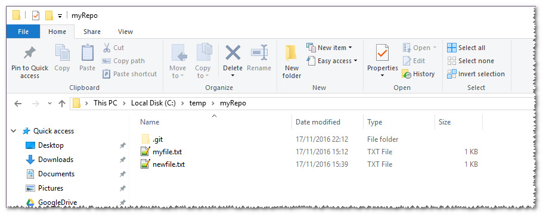
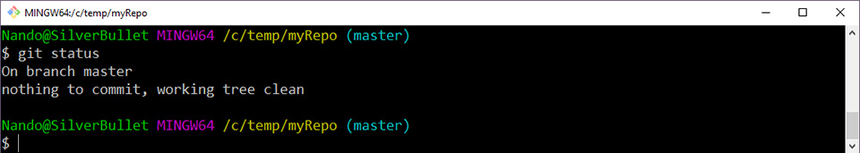
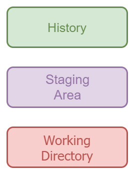
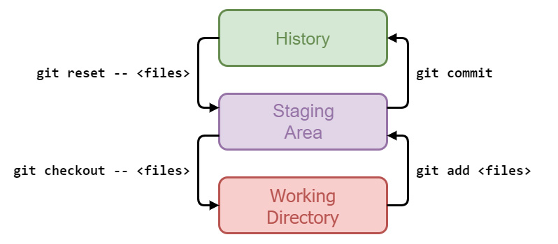

## I tre “luoghi” di Git

Nell’articolo precedente abbiamo visto come **installare** **Git**; una volta preparato l’ambiente, abbiamo poi fatto qualche primo esperimento, iniziando a familiarizzare con lo strumento e con alcuni dei suoi più semplici comandi.

In questo nuovo appuntamento, prenderemo in esame alcuni **concetti fondamentali**, i quali, una volta assimilati, ci permetteranno di comprendere anche le sequenze di comandi e le operazioni più complesse.

La struttura di un repository Git prevede**tre differenti aree** (Working Directory, History, Staging Area) attraversate le quali i nostri file entrano a far parte della sua storia. Capirne il significato sarà l’obiettivo di questa puntata, e per raggiungere l’obiettivo passeremo in rassegna l’insieme di comandi e opzioni che ci consentono di effettuare tutte le operazioni necessarie.

### La Working Directory

Nella precedente puntata abbiamo creato una cartella vuota (**C:\temp\myRepo**) e inizializzato un nuovo repository Git, utilizzando il comando **git init**.

A partire da questo momento possiamo definire questa cartella un **local repository**. Questa cartella contiene tutto il necessario per rendere il repository funzionante, ed è consistente: è infatti possibile spostare la cartella senza che né il repository né alcun file in esso contenuto vengano compromessi.

All’interno di ogni local repository di Git troviamo la sottocartella **.git**; essa è una cosiddetta **dotfolder**, ovvero una cartella il cui nome inizia con un punto (“dot”); questa convenzione, comune su sistemi Unix-like come ad esempio Linux, ha iniziato a essere utilizzata anche su software impacchettato per la piattaforma Windows. In queste cartelle ci vanno a finire in genere file di **configurazione** e/o file **intermedi** necessari all’applicazione di riferimento per funzionare correttamente.

Nel caso di Git, questa cartella contiene la configurazione del repository corrente e diversi file che con il tempo impareremo a conoscere. Nota bene: in Windows questa cartella risulta nascosta; nel caso non fosse visibile, è necessario modificare le impostazioni del sistema affinché risultino visibili anche file e cartelle nascosti.



*Figura 1 – La dotfolder .git: nei sistemi Windows è nascosta, quindi occorre rendere visibili le cartelle nascoste.*

I file e le cartelle che invece stanno fuori dalla dotfolder **.git** compongono quella che in gergo viene chiamata **working directory**. In essa sono contenuti i file che rappresentano lo stato attuale del branch sul quale siamo posizionati e, per la precisione, la “fotografia” aggiornata all’ultimo commit effettuato.



*Figura 2 – Siamo sul branch master e nessuna modifica è in corso.*

Come si nota in figura 2, siamo infatti posizionati sul branch **master**, ed il nostro stato attuale è “**nothing to commit, working tree clean**”. Questo significa che non è in corso alcuna modifica, per cui i file che abbiamo all’interno della nostra **working** **directory** sono identici a quelli già presenti nell’ultimo **commit**.

### La History

Per **History** s’intende la “storia” del nostro repository; così come in natura il tempo è scandito dagli eventi, anche il nostro repository risulta composto da una successione ordinata di elementi, i **commit**.

Quando un repository nasce, con il comando **git init**, e quando per la prima volta effettuiamo un commit, diamo origine a una sequenza di elementi concatenati, ognuno dei quali sarà legato indissolubilmente all’elemento che lo precede. Questa serie di commit già presenti all’interno del nostro repository rappresentano appunto la history, e l’ultimo commit effettuato sarà lo stato al quale Git farà riferimento per evidenziare le modifiche che man mano andremo ad apportare nella nostra **Working** **Directory**.

Fra **History** e **Working** **Directory** vi è però una terza zona, la **Staging Area**.

### La Staging Area

La **Staging Area** (spesso indicata anche come **index**) è un’area intermedia che si frappone fra la **Working Directory** e la **History** (figura 3).



*Figura 3 – La Staging Area si frappone tra Working Directory e History.*

Il concetto di **Staging Area** è uno fra quelli che più turba coloro i quali sono abituati ad altri sistemi di versionamento, in quanto esso rappresenta per loro una novità; in Subversion [1]  ad esempio, esistono solo due **luoghi**: il **server remoto**, che contiene la storia di tutti i commit effettuati in precedenza — la history di cui sopra — e la propria cartella su disco — la working directory — contenente i file scaricati dal server. Quando si varia lo stato della propria cartella modificando, aggiungendo o cancellando dei file, **Subversion** si accorge del cambiamento e propone di conseguenza l’invio al server degli aggiornamenti effettuati: la spiegazione è giocoforza semplificata e non me ne vogliano gli esperti di Subversion.

In Git invece esiste quest’area intermedia, dove di volta in volta andare ad aggiungere le modifiche che si vogliono includere nel prossimo **commit**; nel precedente articolo abbiamo visto come indicare a Git di tenere traccia di un nuovo file, usando il comando**git add**; sarà sempre usando il comando **git add** che diremo di volta in volta a Git di includere nel prossimo commit le modifiche avvenute a file e cartelle nella nostra Working Directory.

Ma che senso ha avere un’area intermedia? Molto spesso questo confonde, perché viene ritenuta un inutile impiccio, un passaggio in più, peraltro obbligato, che di contro non fornisce utilità alcuna.

### Ragioni a favore della Staging Area

Cercheremo ora di capire insieme perché invece questo **livello di separazione** ritorni utile, anche solo marginalmente, visto che sarà solo quando avremo acquisito dimestichezza con comandi più complessi che potremo apprezzarne appieno l’effettiva utilità.

Vi è mai capitato di avere **troppe** modifiche da committare? O di averne di **diversa** **natura**, per cui risulti utile raggrupparle in due o più commit? Una delle cose che è possibile fare utilizzando la staging area è proprio questa: includere in essa solo **parte** delle **modifiche** in corso, affinché sia poi possibile effettuare un altro commit separato. Gli utilizzatori di Subversion staranno già pensando: “ma questa cosa si può fare anche in SVN!”. È vero, anche Subversion prevede la possibilità di escludere file aggiunti, modificati o cancellati nel commit che ci si accinge ad eseguire (a tal proposito, si vedano le Subversion changelist [2]).

Git però consente di fare anche qualcosa in più: ad esempio, tra le varie modifiche susseguenti apportate a uno stesso file è possibile includerne nel prossimo commit solo alcune, lasciando le altre in sospeso.

Utile, non credete? Personalmente cerco sempre di eseguire **modifiche** **piccole** e **circoscritte**, per cui il problema non mi si pone di frequente, ma quando non ci riesco, e finisco per trovarmi in situazioni come queste, so che nella cassetta degli attrezzi di Git c’è l’opzione **–patch** (o **-p**) che, usata in combinazione con il comando **git add**, mi consente di definire con precisione chirurgica quali sono le modifiche a un file da includere nel commit in preparazione.

Per ora accontentiamoci di questo; in futuro vedremo quanto sia utile per gestire integrazioni fra diversi rami di sviluppo.

## Git internals

È giunto il momento di vedere come Git gestisce queste tre aree, quali siano i comandi per interagire con esse e l’effetto pratico che questi ultimi comportano.

I comandi che utilizzeremo sono (**git**) **add**, **commit**, **reset**e **checkout**.

### git add

Il comando **git add** abbiamo già imparato a conoscerlo; in passato abbiamo infatti detto che il suo compito è quello di dire a Git di tracciare le modifiche effettuate a un file. Internamente però, Git non fa altro che copiare il file dalla **Working** **Directory** alla **Staging** **Area**. Quando eseguiamo il comando **git status** per vedere lo stato attuale del repository e Git ci segnala che un file risulta modificato è perché semplicemente la copia del file nella Staging Area è differente da quella che si trova nella Working Directory.

### git checkout

Se volessimo ad esempio annullare le modifiche a un file non ancora aggiunte alla Staging Area, possiamo utilizzare il comando **git checkout**, che altro non fa che copiare il file dalla Staging Area alla Working Directory, riportandolo di conseguenza allo stato antecedente.

### git commit

Per archiviare al sicuro le modifiche effettuate abbiamo visto che si usa il comando **git commit**, attraverso il quale creiamo un punto fermo nella storia del nostro repository.

### git reset

Se a un certo punto volessimo rimuovere le modifiche aggiunte alla Staging Area ma non ancora committate, possiamo usare il comando **git reset**, che non fa altro che copiare il file presente nell’ultimo commit della History all’interno della Staging Area: questo riporterà la situazione al momento in cui le nostre modifiche non erano “**staged**” ossia aggiunte alla staging area.

### Un quadro riassuntivo

In figura 4 è riportato uno specchietto riassuntivo di quanto appena illustrato.



*Figura 4 – Le relazioni tra le tre aree di Git e i comandi che determinano i passaggi tra esse.*

Da notare il **doppio trattino** “**—**“ che segue i comandi di **checkout** e di **reset**; questo **doppio trattino** non altera il comportamento dei due comandi, ma serve per renderne più esplicito l’uso. Come vedremo più avanti, oltre che per ripristinare file, i comandi **checkout** e **reset** sono utilizzati anche durante l’interazione con i **branch**; durante il proprio lavoro potrebbero manifestarsi alcune sfortunate situazioni in cui Git non sa cosa fare: in casi come questi il doppio trattino **—** diventa indispensabile. Ma vediamo un esempio per capire meglio.

Prendiamo **git checkou**t, che serve anche per passare da un branch all’altro, e supponiamo che nel nostro repository oltre al **master** ci sia anche un branch di nome **hello** e inoltre un file con lo stesso nome, che nel frattempo è stato modificato. A questo punto, se impartiamo il comando **git checkout hello**, Git non è in grado di determinare univocamente le nostre intenzioni: vogliamo annullare le modifiche locali al file “hello” oppure vogliamo cambiare branch? In casi come questi il **doppio** **trattino** risulta necessario per indicare a Git che siamo nel primo caso, e cioè vogliamo riprendere il file “hello” dalla Staging Area, annullando le modifiche locali. Usare il **doppio** **trattino** **—** non è obbligatorio, visto che nella maggior parte dei casi Git “capisce da solo” in quale caso siamo, ma il suo uso risulta comunque una buona pratica per evitare brutte sorprese, soprattutto ora che ne sappiamo significato e motivazione. Per maggiori informazioni si veda [3].

## Esercizi

È giunta l’ora di verificare se abbiamo afferrato i concetti suesposti; proviamo ad eseguire insieme qualche piccolo esercizio.

### Esercizio 1: annullare una modifica non ancora aggiunta alla staging area

Giusto per fare un po’ di ripasso, ripartiamo da zero; questo il piano d’azione:

1. inizializziamo un nuovo repository con **git init**;
2. creiamo un file txt con una riga di testo all’interno;
3. aggiungiamolo alla staging area con **git add**;
4. eseguiamo il primo commit con **git commit**.

Ora che abbiamo un primo commit, entriamo nel vivo del nostro esercizio:

1. modifichiamo il file;
2. verifichiamo lo stato con **git status**: il file risulterà modificato;
3. annulliamo le modifiche con **git checkout —**

Di seguito la sequenza di comandi digitati nella shell Bash su Windows; l’eventuale “**#testo che inizia con cancelletto**” rappresenta un commento aggiunto in questa sede per meglio evidenziare i passaggi salienti.

```
Nando@SilverBullet MINGW64 /c/temp/es01
 $ git init #inizializziamo un nuovo repository in una cartella vuota
 Initialized empty Git repository in C:/temp/es01/.git/

 Nando@SilverBullet MINGW64 /c/temp/es01 (master)
 $ vim file01.txt # usiamo Vim o altro editor per creare ed editare un nuovo file

 Nando@SilverBullet MINGW64 /c/temp/es01 (master)
 $ git add file01.txt #aggiungiamo il file01.txt alla staging area

 Nando@SilverBullet MINGW64 /c/temp/es01 (master)
 $ git commit -m "First commit, file01" #eseguiamo il primo commit sul nostro repo
 [master (root-commit) 4f9647b] First commit, file01 #root commit = primo commit
 1 file changed, 1 insertion(+)
 create mode 100644 file01.txt

 Nando@SilverBullet MINGW64 /c/temp/es01 (master)
 $ vim file01.txt #modifichiamo il file a piacere, ad es. aggiungendo una seconda riga di testo

 Nando@SilverBullet MINGW64 /c/temp/es01 (master)
 $ git status #verifichiamo la situazione attuale
 On branch master
 Changes not staged for commit:
 (use "git add <file>..." to update what will be committed)
 (use "git checkout -- <file>..." to discard changes in working directory)
 modified:   file01.txt #il file risulta modificato
 no changes added to commit (use "git add" and/or "git commit -a") #il file non è stato ancora aggiunto alla staging area
 Nando@SilverBullet MINGW64 /c/temp/es01 (master)
 $ git diff #con git diff si possono vedere le differenze
 diff --git a/file01.txt b/file01.txt
 index d60cfd3..0a00f55 100644
 --- a/file01.txt
 +++ b/file01.txt
 @@ -1 +1,2 @@
 This is file 01   #questa è la linea di testo già presente nel file01.txt
 +Adding a second line #questa è la linea appena aggiunta
 \ No newline at end of file
 Nando@SilverBullet MINGW64 /c/temp/es01 (master)
 $ git checkout -- file01.txt #momento clou: annullo le mie modifiche locali
 Nando@SilverBullet MINGW64 /c/temp/es01 (master)
 $ git status #ok, ora Git mi dice che non ci sono più differenze
 On branch master
 nothing to commit, working tree clean
```

### Commenti all’esercizio 1

Un ultimo commento prima di concludere l’esercizio: **git checkout —** annulla le vostre modifiche locali ai file indicati, e tali modifiche saranno irrimediabilmente perse! Quindi fate attenzione a usare comandi tipo **git checkout — .** (che significa “annulla tutti i cambiamenti locali ai file tracciati”), potreste perdere modifiche importanti ad altri file che in quel momento non ricordavate.

### Esercizio 2: rimuovere un file modificato dalla staging area

Teniamo buono quanto fatto prima: il nostro repo con un primo commit effettuato.

1. modifichiamo il file01.txt
2. verifichiamo: il file risulterà modificato, fuori dalla staging area (testo in rosso);
3. aggiungiamo il file modificato alla staging area con **git add**
4. verifichiamo: il file risulterà modificato ed incluso nella staging area (testo in verde);
5. togliamo il file dalla staging area con **git reset —**

Di seguito la sequenza di comandi digitati nella mia personale bash su Windows.

```
Nando@SilverBullet MINGW64 /c/temp/es01 (master)
 $ vim file01.txt #modifichiamo il file a piacere, ad es. aggiungendo una riga di testo

 Nando@SilverBullet MINGW64 /c/temp/es01 (master)
 $ git status #verifichiamo la situazione attuale
 On branch master
 Changes not staged for commit:
 (use "git add <file>..." to update what will be committed)
 (use "git checkout -- <file>..." to discard changes in working directory)
 modified:   file01.txt #il file risulta modificato, ma non è ancora nella staging area
 no changes added to commit (use "git add" and/or "git commit -a")
 Nando@SilverBullet MINGW64 /c/temp/es01 (master)
 $ git add file01.txt #aggiungiamo il file alla staging area
 Nando@SilverBullet MINGW64 /c/temp/es01 (master)
 $ git status
 On branch master
 Changes to be committed:
 (use "git reset HEAD <file>..." to unstage)
 modified:   file01.txt #ora il file risulta incluso nella staging area
 Nando@SilverBullet MINGW64 /c/temp/es01 (master)
 $ git reset -- file01.txt #momento clou: rimuoviamo il file dalla staging area
 Unstaged changes after reset:
 M   file01.txt
 #Git ci indica qui i cambiamenti “unstaged”, ovvero rimossi dalla staging area #La M sta per Modified; potremmo trovare la A di Added e la D di Deleted, nel caso decidessimo rispettivamente di non aggiungere più un file o di non procedere più alla sua eliminazione col prossimo commit

 Nando@SilverBullet MINGW64 /c/temp/es01 (master)
 $ git status #ri-verifichiamo ora la situazione
 On branch master
 Changes not staged for commit:
 (use "git add <file>..." to update what will be committed)
 (use "git checkout -- <file>..." to discard changes in working directory)
 modified:   file01.txt #siamo tornati ad avere il file al di fuori della staging area
 no changes added to commit (use "git add" and/or "git commit -a")
```

### Commenti all’esercizio 2

Il comando **git reset** è un comando molto potente, e con esso è possibile eseguire una vasta serie di operazioni. In questo specifico caso l’abbiamo usato per togliere dalla staging area un file modificato in precedenza, cosa che capita quando ad esempio non vogliamo che le modifiche in esso contenute vadano a far parte del prossimo commit, ma le vogliamo tenere “in panchina” per farle entrare in quello successivo. In questo caso **git reset** non “distrugge” le nostre modifiche locali: di fatto fa il contrario di **git add**. Però anche **git reset** può diventare pericoloso se chiamato con altri parametri e opzioni: questo aspetto lo vedremo in un prossimo articolo e per ora basti sapere che questo comando va usato comunque con cautela.

## Conclusioni

In questa terza parte abbiamo aperto il cofano e cominciato a dare un’occhiata al motore, osservando più da vicino in che modo i comandi che impartiamo facciano muovere la macchina di Git.

La strada da percorrere però prevede ancora alcune tappe fondamentali prima che il suo funzionamento interno sia chiaro. Nelle prossime puntate andremo ancora più a fondo, analizzando nel dettaglio le operazioni che Git compie al fine di stoccare file e modifiche che eseguiamo all’interno del nostro repository.

MOLONGUI AUTHORSHIP PLUGIN 5.2.9

https://www.molongui.com/wordpress-plugin-post-authors
