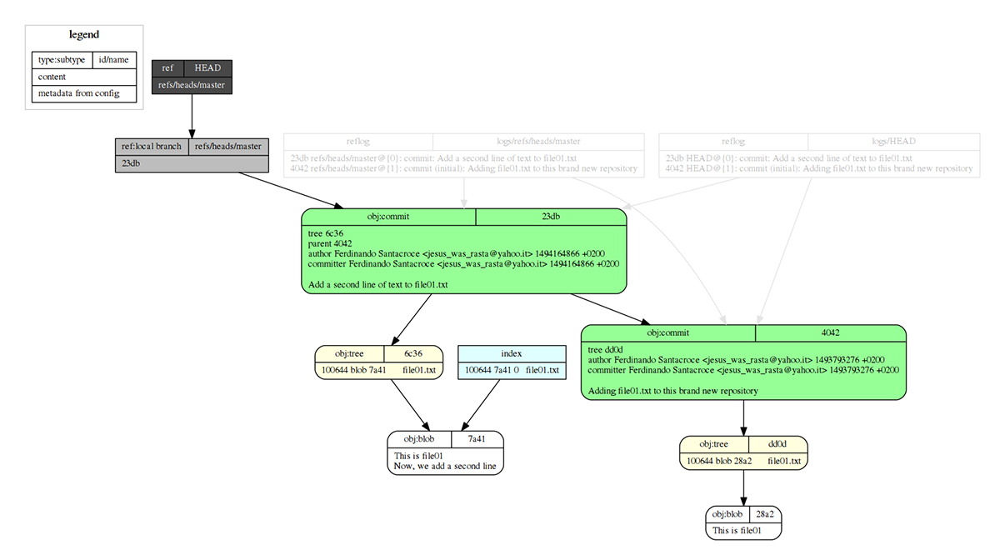

## Blob, tree e… commit

Durante lo scorso appuntamento abbiamo messo sotto la nostra lente di ingrandimento due degli **objects** di **Git**; parliamo dei **blob**, ciò che di fatto conserva i nostri file all’interno di un repository, e dei **tree**, che invece contengono tutte le informazioni necessarie per ricostruire la struttura di file e directory del nostro repository in qualsiasi **istante**.

Questi **istanti**, questi **snapshot** che facciamo per tracciare i momenti importanti nella vita di un repository sono rappresentati dai **commit**, di cui ora andremo a parlare più in dettaglio.

## I commit

Così come gli altri **objects**, anche i commit sono rappresentati da un file all’interno della cartella **.git**; ripassiamo un po’ quanto fatto fino a ora ed eseguiamo un **commit** su un nuovo repository, in modo da poterne poi verificare struttura e contenuti:

```
[1] /home
$ mkdir es02

[2] /home
$ cd es02/

[3] /home/es02
$ git init
Initialized empty Git repository in home/nando/es02/.git/

[4] /home/es02 (master)
$ touch file01.txt

[5] /home/es02 (master)
$ vi file01.txt

[6] /home/es02 (master)
$ git add file01.txt
warning: LF will be replaced by CRLF in file01.txt.
The file will have its original line endings
in your working directory.

[7] /home/es02 (master)
$ git commit -m "Adding file01.txt to this brand new repository"

*** Please tell me who you are.

Run

  git config --global user.email "you@example.com"
  git config --global user.name "Your Name"

to set your account's default identity.
Omit --global to set the identity only in this repository.

fatal: no name was given and auto-detection is disabled

[8] /home/es02 (master)
$ git config user.email "jesus_was_rasta@yahoo.it"

[9] /home/es02 (master)
$ git config user.name "Ferdinando Santacroce"

[10] /home/es02 (master)
$ git commit -m "Adding file01.txt to this brand new repository"
[master (root-commit) 404276b]
Adding file01.txt to this brand new repository
  1 file changed, 1 insertion(+)
  create mode 100644 file01.txt
```

### I passi del commit

Riepiloghiamo le azioni eseguite dai vari comandi impartiti:

1. Crea la cartella “**es02**”.
2. Entra nella cartella.
3. Inizializza un nuovo repository con il comando **git init**; viene creata di conseguenza la cartella **.git** all’interno della cartella **es02**.
4. Crea un nuovo file chiamato **txt**.
5. Edita il file, scrivendo al suo interno “**This is file01**”.
6. Aggiunge il file al repository.
7. Prova a committare il file appena aggiunto, ma riceve un errore; questo comportamento è dovuto a una mia particolare configurazione di Git che, una volta abilitata, obbliga a specificare per ogni nuovo repository creato il nome utente e la mail che si vogliono utilizzare; in questo modo evito di eseguire commit su codice che modifico per lavoro con un’utenza personale e viceversa. Se ve lo state chiedendo, il **flag** da abilitare è **useconfigonly**, e lo potete fare digitando il comando **git config –global user.useconfigonly true**.
8. Configurare l’email dell’utente.
9. Configura il nome dell’utente.
10. Riprova a eseguire il commit, questa volta con successo.

## L’analisi del commit

Andiamo ora a dare un’occhiata al commit appena eseguito; usando **git log**, vediamo le informazioni principali:

```
[11] /home/es02 (master)
$ git log
commit 404276b63bdfb2aa99dbff4bb25a1d5d51f35e85
Author: Ferdinando Santacroce <jesus_was_rasta@yahoo.it>
Date:  Wed May 3 08:34:36 2017 +0200

  Adding file01.txt to this brand new repository
```

Fra queste informazioni troviamo:

- **commit**: l’hash del commit; come ogni object, anche i commit sono contraddistinti da un’hash SHA-1 univoco, e vengono anche loro salvati nella cartella **.git** insieme a tree e blob.
- **Author**: l’autore del commit, seguito dalla sua email.
- **Date**: la data in cui il commit è stato eseguito.
- Il **commento** a corredo del commit.

Queste sono le informazioni principali di un commit, quelle che in genere interessa vedere nel 99% dei casi; noi invece andremo più a fondo, per cercare di capire meglio come i commit si susseguono all’interno di un repository.

### Ulteriori informazioni di un commit

Iniziamo andando a leggere meglio l’output dato dal comando numero **10**; al nostro commit, Git ha risposto così:

```
[10] /home/es02 (master)
$ git commit -m "Adding file01.txt to this brand new repository"
[master (root-commit) 404276b]
Adding file01.txt to this brand new repository
  1 file changed, 1 insertion(+)
  create mode 100644 file01.txt
```

Partiamo da quanto racchiuso tra parentesi quadre; **master** sta ad indicare il nome del branch sul quale è stato eseguito il commit; come già abbiamo detto in precedenza, **master** è il branch predefinito creato di default in ogni repository Git… un po’ come il trunk di Subversion, per chi è avvezzo.

Tra parentesi tonde, invece, troviamo **(root-commit)**, una dicitura che non vedremo mai più in questo repository; il primo commit infatti è un commit un po’ differente rispetto a tutti gli altri commit che andremo ad effettuare, perché a differenza degli altri **non** ha un “parent” (un genitore, un commit che lo precede).

Per ricostruire la storia di un repository, infatti, Git adotta una tecnica molte semplice, ma anche molto efficace: lega ogni singolo commit a quello che lo precede. In questo modo, a partire da un qualsiasi commit all’interno del repository, sia esso l’ultimo o uno scelto a piacere, sarà sempre possibile scorrere l’**albero** del **repository** a **ritroso**, andando da un commit a quello che lo precede, e poi ancora indietro fino ad arrivare appunto al root commit, punto inziale della storia del repository.

## Nuovo commit

Procediamo ora effettuando un nuovo **commit**, che prevede la modifica del file precedentemente aggiunto:

```
[12] /home/es02 (master)
$ vi file01.txt

[13] /home/es02 (master)
$ git status
On branch master
Changes not staged for commit:
  (use "git add <file>..." to update what will be committed)
  (use "git checkout -- <file>..." to discard changes in working directory)

    modified: file01.txt

no changes added to commit (use "git add" and/or "git commit -a")

[14] /home/es02 (master)
$ git add file01.txt
warning: LF will be replaced by CRLF in file01.txt.
The file will have its original line endings
in your working directory.

[15] /home/es02 (master)
$ git commit -m "Add a second line of text to file01.txt"
[master 23db710] Add a second line of text to file01.txt
  1 file changed, 1 insertion(+)

[16] /home/es02 (master)
$ git log
commit 23db710a782af7c177c96bdb9b0359aa227a203c
Author: Ferdinando Santacroce <jesus_was_rasta@yahoo.it>
Date:  Sun May 7 15:47:46 2017 +0200

  Add a second line of text to file01.txt

 commit 404276b63bdfb2aa99dbff4bb25a1d5d51f35e85
 Author: Ferdinando Santacroce <jesus_was_rasta@yahoo.it>
 Date:  Wed May 3 08:34:36 2017 +0200

  Adding file01.txt to this brand new repository
```

### Guardare “dentro”

Scopriamo come fa Git a costruire questo genere di relazioni tra i commit; utilizzando il comando **git** **cat-file -p**, osserviamo il contenuto del secondo commit effettuato:

```
[17] /home/es02 (master)
$ git cat-file -p 23db710
tree 6c36fbd1d748731c46cb12eec5900780d3a0caa5
parent 404276b63bdfb2aa99dbff4bb25a1d5d51f35e85
author Ferdinando Santacroce <jesus_was_rasta@yahoo.it> 1494164866 +0200
committer Ferdinando Santacroce <jesus_was_rasta@yahoo.it> 1494164866 +0200

Add a second line of text to file01.txt
```

Nell’ordine, troviamo:

- **tree**: riporta l’hash del tree object contenitore di tutto, ossia la cartella “root” del nostro repository, allo stato in cui si trova ora. Con le conoscenze acquisite fin qui, sappiamo già che in quel tree sarà contenuto il blob object che racchiude il nostro **txt** nello stato in cui si trova adesso, ossia con due righe di testo, una aggiunta al primo commit e una al secondo.
- **parent**: riporta l’hash del commit che precede quello che stiamo analizzando; ecco quindi svelata la magia: come si diceva poc’anzi, ogni commit contiene un riferimento al commit che lo precede — escluso il root commit ovviamente — e questo riferimento non è che l’hash SHA-1 del commit.
- **author**: riporta l’autore del commit.
- **committer**: riporta colui che ha eseguito il commit; vi starete chiedendo: “Ma perché sono distiniti? Autore e committer non sono sempre la stessa persona?”. Sì, in genere lo sono, ma in particolari occasioni potrebbe essere necessario committare del codice per conto terzi; in casi come questi, per rendere esplicita la cosa, è possibile eseguire un commit esplicitandone l’autore, di modo che nella storia del repository rimanga traccia del fatto che il commit è stato fatto sì da una persona, ma per conto di qualcun altro. Per chi fosse interessato, l’opzione da utilizzare è **–author** come nell’esempio **git commit –author=”Author Name <email@address.com>”**.
- Una riga vuota.
- Il messaggio di commit.

Osserviamo invece il contenuto del root commit, il primo commit eseguito:

```
[18] /home/es02 (master)
$ git cat-file -p 404276b
tree dd0d89f1f32bc8b3cc9d9b4491c71075b8971206
author Ferdinando Santacroce <jesus_was_rasta@yahoo.it> 1493793276 +0200
committer Ferdinando Santacroce <jesus_was_rasta@yahoo.it> 1493793276 +0200

  Adding file01.txt to this brand new repository
```

Come avrete già notato, in questo commit **non** è presente un riferimento al **parent**; questo basta a Git per stabilire che si tratta del **root** **commit**; quindi, giunto a questo punto, sarà solo qui che terminerà un eventuale percorso a ritroso da un qualsiasi commit fino all’origine di tutto.

## Lo schema del repository

Di seguito, riportiamo una rappresentazione grafica (figura 1) con uno schema dettagliato della struttura attuale del repository appena creato; si vedono **tree** (in giallo), **blob** (in bianco), **commit** (in verde) e tutte le relazioni che intercorrono fra essi, rappresentate da frecce orientate. L’immagine è generata **[git-draw](https://github.com/sensorflo/git-draw)**.



*Figura 1 – La struttura del repository: in giallo i tree, in bianco i blob, in verde i commit.*

Da notare come il verso della freccia che unisce i commit parta dal secondo commit e vada verso il primo, ossia dal discendente verso il suo antenato; può sembrare un dettaglio, ma è importante che in rappresentazioni grafiche come queste il verso sia correttamente indicato, al fine di evidenziare nella giusta maniera il rapporto che lega i commit fra di loro: è sempre il figlio che dipende dal padre.

Si vedono inoltre cose a noi ancora sconosciute (**refs**, in grigio chiaro e scuro, e **reflog** in tratto semi-trasparente), ma di cui presto faremo conoscenza.

Vista e analizzata quest’ultima immagine non dovreste più avere difficoltà a visualizzare la struttura di un repository Git, o perlomeno quel che riguarda la memorizzazione di file e cartelle al suo interno attraverso la composizione di un commit.

## Conclusioni

Termina così la nostra esplorazione nel mondo dei Git objects; rimangono fuori solo i tag, che però approfondiremo in futuro. Nelle prossime puntate apriremo un nuovo capitolo dedicato alle **references**, ossia al sistema che Git ci offre per muoverci da un punto all’altro all’interno di un repository.

MOLONGUI AUTHORSHIP PLUGIN 5.2.9

https://www.molongui.com/wordpress-plugin-post-authors
