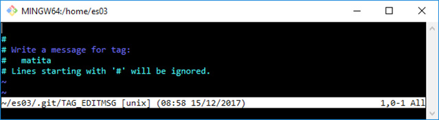

## I tag: “pietre miliari” in un repository

In questo nuovo appuntamento della serie su Git, diamo un’occhiata ai **tag**; come saprete, i tag sono “pietre miliari” all’interno di un repository, e vengono spesso utilizzati per fissare un passaggio importante nell’evoluzione del nostro del nostro progetto, ad esempio una nuova release

Nell’articolo, vedremo in che modo Git è in grado di gestire i **tag**, e quali sono le funzionalità che ci mette a disposizione.

## I tag sono etichette fisse

I **tag** sono **etichette** che possono essere applicate a un **commit**, ma, a differenza dei **branch**, questi **tag** rimarranno per sempre “appiccicati” allo stesso **commit**.

Creare un tag è semplice: si ha bisogno solo del comando **git tag**, seguito da un nome a scelta, che rispetti le stesse convenzioni già viste in passato per i **branch** [1]; per provarlo, possiamo crearne uno nel “tip commit” (ossia l’ultimo) del ramo **bevande**; riprendiamo quindi il nostro **repository** ed eseguiamo il checkout del branch **bevande**:

```
 [1] ~/es03 (snack)
 $ git checkout bevande
 Switched to branch ‘bevande’
 [2] ~/es03 (bevande)
 $ git log --graph --decorate --oneline --all
 * e29f5c6 (snack) Aggiunge lista snack a disposizione per l’ufficio
 | * 4072e76 (HEAD -> bevande) Aggiunge l’acqua alle bibite
 |/
 * 87cacc7 (master) Aggiunge una matita
 * 6cf12f4 Aggiunge una penna alla lista della cancelleria
```

### git tag

Utilizziamo ora il comando **git tag** seguito da un nome a piacere, ad esempio **acqua**:

```
 [3] ~/es03 (bevande)
 $ git tag acqua
```

Vediamo cosa dice il log di Git:

```
 [4] ~/es03 (bevande)
 $ git log --graph --decorate --oneline --all
 * e29f5c6 (snack) Aggiunge lista snack a disposizione per l’ufficio
 | * 4072e76 (HEAD -> bevande, tag: acqua) Aggiunge l’acqua alle bibite
 |/
 * 87cacc7 (master) Aggiunge una matita
 * 6cf12f4 Aggiunge una penna alla lista della cancelleria
```

Come si può vedere nel log, ora sulla “foglia” del ramo **bevande** c’è anche un **tag** chiamato **acqua**; su quel **commit** quindi ora albergano tre **reference**: **HEAD**, il branch **bevande** ed il tag **acqua**.

Se ora facessimo un commit in questo ramo, vedremmo che il tag **acqua** rimane al suo posto, mentre **HEAD** e il branch **bevande** proseguono la strada; per fare un piccolo esperimento, aggiungete una nuova riga al file **bibite.txt**:

```
 [5] ~/es03 (bevande)
 $ ll
 total 14
 drwxr-xr-x 1 san 1049089 0 Dec 15 08:33 ./
 drwxr-xr-x 1 san 1049089 0 Nov 10 15:12 ../
 drwxr-xr-x 1 san 1049089 0 Dec 15 08:33 .git/
 -rw-r--r-- 1 san 1049089 6 Dec 15 08:33 bibite.txt
 -rw-r--r-- 1 san 1049089 13 Oct 1 17:16 cancelleria.txt
 [6] ~/es03 (bevande)
 $ echo “chinotto” >> bibite.txt
```

Eseguite ora un commit:

```
 [7] ~/es03 (bevande)
 $ git status
 On branch bevande
 Changes not staged for commit:
     (use “git add <file>...” to update what will be committed)
     (use “git checkout -- <file>...” to discard changes in working directory)
         modified:   bibite.txt
 no changes added to commit (use “git add” and/or “git commit -a”)
 [8] ~/es03 (bevande)
 $ git commit -am “Aggiunge il chinotto alla lista delle bevande”
 [bevande 17fd57b] Aggiunge il chinotto alla lista delle bevande
     1 file changed, 1 insertion(+)
```

Esaminiamo ora la situazione attuale:

```
 [9] ~/es03 (bevande)
 $ git log --graph --decorate --oneline --all
 * 17fd57b (HEAD -> bevande) Aggiunge il chinotto alla lista delle bevande
 * 4072e76 (tag: acqua) Aggiunge l’acqua alle bibite
 | * e29f5c6 (snack) Aggiunge lista snack a disposizione per l’ufficio
 |/
 * 87cacc7 (master) Aggiunge una matita
 * 6cf12f4 Aggiunge una penna alla lista della cancelleria
```

Questo è esattamente quello che abbiamo previsto: mentre **HEAD** e il branch **bevande** hanno seguito l’evoluzione dei **commit**, spostandosi all’ultimo **commit** eseguito, il tag **acqua** è rimasto al suo posto.

### Uso e utilità dei tag

I tag sono utili per dare un significato peculiare a alcuni **commit** **particolari**; per esempio, da sviluppatore, può risultare utile etichettare ogni **release** del proprio software: ecco, ciò che c’è da sapere sulla creazione di un semplice tag è tutto qui… o quasi.

Anche i tag sono **reference** e vengono memorizzati, come i branch, sotto forma di semplici **file** **di** **testo** nella sottocartella **tags** all’interno della cartella **.git**; date un’occhiata sotto la cartella **.git/refs/tags**, e vedrete un file **acqua**. Guardiamone il contenuto:

```
 [10] ~/es03 (bevande)
 $ cat .git/refs/tags/acqua
 4072e76d6b86ba717bb1e43d0e43576ef4bfe676
```

Come forse avevate già previsto nella vostra testa, il file contiene lo **hash** del **commit** a cui si riferisce.

### Rimuovere un tag

Per eliminare un **tag**, è sufficiente aggiungere l’ opzione **–d**, per esempio:

```
 git tag -d <nome del tag>
```

Poiché, per definizione, **non è possibile spostare un tag**, se ci si rende conto che un tag andava messo su un commit diverso è necessario **eliminare** il tag precedente e crearne uno nuovo con lo stesso nome associato al commit desiderato.

È possibile creare un tag che punti a un particolare commit là dove si desidera e in qualsiasi momento; basta aggiungere l’hash del commit come argomento, ad esempio:

```
 git tag mioTag 07b1858.
```

## Tag annotati

Git ha **due** **tipi** diversi di **tag**; questo perché in alcune situazioni si potrebbe voler aggiungere un messaggio — ad esempio il changelog o le note di release del proprio software — o semplicemente perché si vuole associare al tag il nome dell’autore.

Noi per ora abbiamo visto il primo tipo di tag, quello più semplice; ma i tag che possono contenere le informazioni extra appena menzionate appartengono al secondo tipo, gli **annotated tag**.

Un **annotated tag** è **sia** una **reference** che un **object** di Git, come lo sono **commit**, **tree** e **blob**. Quando in passato abbiamo introdotto i Git **objects**, infatti, i più attenti ricorderanno che avevamo accennato al fatto che i Git objects erano 4: **commit**, **tree**, **blob** e, appunto, **annotated** **tag**. Ora andiamo finalmente a completare la nostra conoscenza al riguardo.

### Creare un tag annotato

Per crearne un **tag** annotato basta aggiungere l’opzione **-a** al comando **git tag**; creiamone uno che punti al commit in cui abbiamo aggiunto una matita alla lista della cancelleria; eseguiamo un **git log** per scoprire l’hash di quel commit:

```
 [11] ~/es03 (bevande)
 $ git log --graph --decorate --oneline --all
 * 17fd57b (HEAD -> bevande) Aggiunge il chinotto alla lista delle bevande
 * 4072e76 (tag: acqua) Aggiunge l’acqua alle bibite
 | * e29f5c6 (snack) Aggiunge lista snack a disposizione per l’ufficio
 |/
 * 87cacc7 (master) Aggiunge una matita
 * 6cf12f4 Aggiunge una penna alla lista della cancelleria
```

Creiamo ora l’annotated tag, utilizzando l’opzione **-a** e l’**hash** del commit a cui vogliamo legare il tag:

```
 [12] ~/es03 (bevande)
 $ git tag -a matita 87cacc7
```

A questo punto Git apre l’**editor predefinito** — Vim nel mio caso — per permetterci di scrivere il messaggio da associare al tag, come è possibile vedere in figura 1.



*Figura 1 – Con il nostro editor predefinito, possiamo scrivere il messaggio da associare al tag annotato.*

Basta indicare un messaggio e poi salvare e uscire; nel caso ve lo foste dimenticato, si usa **:wq** o l’equivalente **😡**.

### Verificare la situazione

Diamo ora un’occhiata ai log:

```
 [13] ~/es03 (bevande)
 $ git log --graph --decorate --oneline --all
 * 17fd57b (HEAD -> bevande) Aggiunge il chinotto alla lista delle bevande
 * 4072e76 (tag: acqua) Aggiunge l’acqua alle bibite
 | * e29f5c6 (snack) Aggiunge lista snack a disposizione per l’ufficio
 |/
 * 87cacc7 (tag: matita, master) Aggiunge una matita
 * 6cf12f4 Aggiunge una penna alla lista della cancelleria
```

OK, ora c’è un nuovo tag sul commit **87cacc7**.

Verifichiamo se è vero che è stata creata una nuova reference:

```
 [14] ~/es03 (bevande)
 $ cat .git/refs/tags/matita
 25b5f6a7289e15e2ca24772a2db62525977275ae
```

Sì, una nuova **reference** è stata creata sotto al cartella **tags**, così come era successo per il tag **acqua**.

Ma verifichiamo altresì se è stato creato anche un nuovo oggetto: proviamo ad analizzare il Git object a cui punta l’hash che abbiamo appena visto nella reference:

```
 [15] ~/es03 (bevande)
 $ git cat-file -p 25b5f6a7289e15e2ca24772a2db62525977275ae
 object 87cacc7d1aafa56815baa14a3ca23afd339e60c7
 type commit
 tag matita
 tagger Ferdinando Santacroce <ferdinando.santacroce@gmail.com> 1513324727 +0100
 Qui è dove abbiamo aggiunto una matita per la prima volta
```

Come si evince dal messaggio, questo è esattamente l’oggetto che Git ha creato con l’operazione precedente; si può notare come:

- esso sia a tutti gli effetti un **commit**, come indicato dalla riga che dice **type commit**;
- al suo interno sia indicata qual è la **reference** associata, indicato dalla riga **tag matita**;
- esso riporti l’autore del tag, denominato “**tagger**”, con tanto di data di creazione del tag.

E così abbiamo visto anche come come appare un **tag annotato**.

Ovviamente, il comando **git** **tag** ha molte altre opzioni, ma qui ho voluto evidenziare solo quelle che penso valga la pena di sapere per il momento. Se però si desidera guardare tutte le opzioni di un comando, ricordo che, per vedere la guida completa, si può sempre fare un

```
 git <command> --help
```

## Conclusioni

In questo breve appuntamento ci siamo concentrati su un argomento specifico, ossia quello dei **tag**; ora abbiamo quindi a disposizione uno strumento in più per organizzare al meglio il nostro **repository**.

Nella prossima puntata andremo un po’ più in profondità sulle “**aree**” che Git ci mette a disposizione per confezionare i nostri commit, dipanando eventuali dubbi su concetti come **HEAD commit**, **staging** **area** e **working tree**.

MOLONGUI AUTHORSHIP PLUGIN 5.2.9

https://www.molongui.com/wordpress-plugin-post-authors
