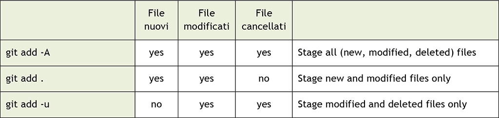
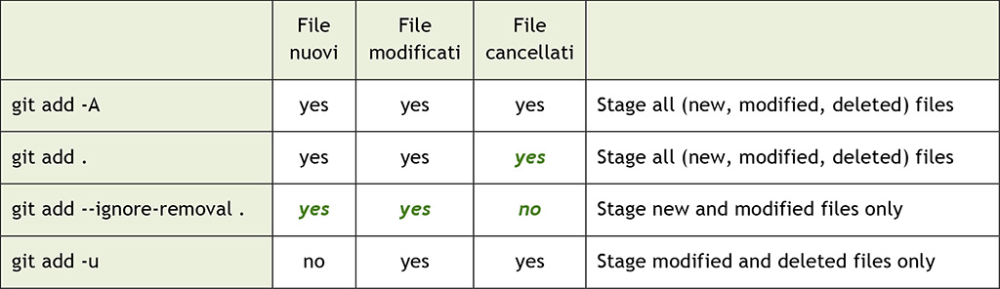

## Introduzione: gestire i file su tre livelli

Anno nuovo, articolo nuovo, che tra l’altro è il decimo di questa lunga serie dedicata ai principi e all’uso di Git. 😊

In questa puntata cominceremo ad analizzare il sistema che Git adopera per **gestire** i **file**. Per tenere traccia del lavoro corrente, dei file che inseriremo nel prossimo commit e di quelli già presenti in un repository, Git si avvale infatti di tre “aree”, vale a dire tre distinti livelli in cui possono essere presenti differenze. Oggi cercheremo di capire come muoverci tra queste aree, competenza questa da acquisire obbligatoriamente per poter usare correttamente questo strumento di versionamento.

In questo articolo inizieremo con una serie di “esperimenti” pratici da fare alla console, per avere fin da subito un riscontro di quello che accade in pratica. Nel prossimo numero, invece, cercheremo di sintetizzare quanto appreso oggi illustrando la “teoria” delle tre aree e approfondendo ulteriormente alcuni comandi.

## Staging area, working tree e HEAD commit

Nelle scorse puntate abbiamo nominato più volte la **staging area**, detta anche **index**, specialmente quando si trattava di aggiungere file al prossimo commit tramite il comando **git** **add**.

A questa si aggiungono il **working tree** e lo **HEAD commit**, che cominceremo a vedere in queste pagine.

### Staging area

Lo scopo della **staging** **area** è proprio quello che abbiamo già visto. Quando si modifica il contenuto di un file, quando se ne aggiunge uno nuovo o se ne elimina uno esistente, è necessario comunicare a Git quale di queste modifiche sarà parte del successivo commit che andremo a confezionare: la **staging** **area** rappresenta proprio il contenitore per questo tipo di informazioni.

Per ora concentriamoci su questo; passiamo al branch **master** del nostro solito repository, quindi digitiamo il comando **git** **status**; questo comando ci permette di vedere lo stato attuale:

```
[1] ~
$ cd es03
```

```
[2] ~/es03 (bevande)
$ git checkout master
Switched to branch ‘master’
```

```
[3] ~/es03 (master)
$ git status
On branch master
nothing to commit, working tree clean
```

Git dice che non c’ è nulla da committare, il nostro **working tree** è pulito.

### Working tree

Ma che cos’è un **working tree**? È la stessa directory di lavoro di cui abbiamo parlato in precedenza, chiamandola **working copy** o **working directory**? La risposta è: “sì e no”; e la cosa confonde un po’, lo so.

Git aveva — e ancora ha — qualche **problema** con i **nomi**; infatti, come abbiamo detto poco sopra, anche per la **staging** **area** abbiamo due nomi: l’altro è **index**. Git usa entrambi questi due nomi sia nei suoi messaggi che nell’output dei comandi, e lo stesso fanno spesso le persone, i libri e i blog come questo. Avere due nomi non è sempre una buona idea, soprattutto quando essi rappresentano esattamente la stessa cosa; per ora l’unica soluzione è esserne consapevoli: il tempo ci darà un Git meno confusionario, ne sono sicuro.

Tornando invece a **working** **tree** e **working** **copy**, la storia è questa. A un certo punto, qualcuno ha sostenuto:

> Se sono nella radice del repository, sono in una directory di lavoro (working directory), ma se mi sposto in una sottocartella, sono in un’altra directory di lavoro.

E in effetti questo è tecnicamente vero da un punto di vista del **filesystem**; in Git invece, operazioni come il **checkout** o il **reset** non influiscono sulla directory di lavoro corrente, ma sull’intero… **working** **tree**, l’intero albero che compone il nostro repository.

In sostanza, parlare di “working directory” in Git può risultare improprio, perché, a differenza di come ad esempio fa Subversion, che consente di fare il checkout solo di alcune parti del repository — cioè solo di alcune cartelle — in Git si ha sempre in locale l’intero repository, l’intero **working** **tree**.

Così, per evitare confusione, Git ha smesso di parlare di working directory nel messaggio di output di git status, e l’ha “ribattezzata” **working tree**. Chi volesse andare un po’ più in profondità può trovare il commit [1] che ha apportato questa modifica sul repo di Git.

Nonostante la brevità e la superficialità della spiegazione, spero di aver chiarito almeno un po’ il perché di questi due nomi.

### I file “staged”

Facciamo ora un piccolo esperimento e aggiungiamo un evidenziatore alla nostra lista della cancelleria:

```
[6] ~/es03 (master)
$ echo “evidenziatore” >> cancelleria.txt
```

Ora facciamo uso di nuovo di questo comando appena imparato, **git status**:

```
[7] ~/es03 (master)
$ git status
On branch master
Changes not staged for commit:
  (use “git add <file>...” to update what will be committed)
  (use “git checkout -- <file>...” to discard changes in working directory)
    modified: cancelleria.txt
no changes added to commit (use “git add” and/or “git commit -a”)
```

OK, leggiamo il messaggio; a un certo punto si legge “Changes not staged for commit”: ora è il momento di ripassare il significato di **staged**; con la parola **staged**, Git indica le modifiche aggiunte alla **staging** **area**, quelle che quindi saranno parte del prossimo **commit**. Nella situazione attuale, abbiamo modificato il file **cancelleria.txt**, ma **non** lo abbiamo ancora aggiunto alla **staging** **area**, utilizzando il buon vecchio comando **git** **add**.

A causa di questo, Git ci informa: dice che c’è un **file** **modificato** (evidenziandolo in rosso), e poi offre due possibilità: una per eseguire lo **stage** del file — e quindi aggiungerlo alla **staging** **area** — attraverso **git add <file>**, e una per scartare la modifica, utilizzando il comando **git checkout — <file>**.

Per ora proviamo ad aggiungerlo alla staging area; vedremo la seconda opzione più tardi. Tra l’altro, è anche l’occasione per apprendere un’ulteriore risvolto sulla sintassi dei comandi. Proviamo a digitare il solo comando **git add**, senza argomenti:

```
[8] ~/es03 (master)
$ git add
Nothing specified, nothing added.
Maybe you wanted to say ‘git add .’?
```

OK: **git add** vuole che venga **specificato** qualcosa da aggiungere, altrimenti non sa cosa fare. Un comportamento comune è usare il **punto** (segno **.**), il quale, per impostazione predefinita, significa “Aggiungi alla staging area tutti i file in questa cartella e relative sottocartelle”. L’equivalente più formale sarebbe **git add -A** (o **–all**) dove **all** / tutti significa:

- “Tutti i file in questa cartella e sottocartelle che ho aggiunto in passato almeno una volta”: questo insieme di file è noto anche come **tracked files**.
- Nuovi file, ossia file che si stanno per aggiungere per la prima volta al repository: questi si chiamano **untracked files**.
- File marcati per la rimozione, ossia file che c’erano prima e che ora Git non trova più nel **working** **tree**, e che quindi si desume siano stati **cancellati**.

### git add . vs git add –A: differenze nelle versioni

C’è però da tenere presente che il comportamento di questo comando è cambiato nel tempo: prima di Git 2. x, eseguire **git add .** o **git add -A** aveva effetti diversi. Di seguito, riportiamo due tabelle che aiutano a capire rapidamente le differenze fra le due versioni; evidenziate in verde trovate i cambiamenti:



*Tabella 1 – git add . vs git add –A: significato dei comandi in Git versione 1.x.*



*Tabella 2 – git add . vs git add –A: significato dei comandi in Git versione 2.x:*

Come si può vedere, in Git 2. x c’ è un nuovo modo per mettere nella staging area **solo** i file **nuovi** e **modificati**: è il comando **git add –ignore-removal**. Inoltre **git add .** è diventato lo stesso di **git add -A**. Se ve lo state chiedendo, l’opzione **-u** presente in Git 2.x è l’ equivalente di **–update**, e viene comoda per aggiungere alla staging area i **soli** file **modificati** ed **eliminati**, ma **non** quelli **nuovi**.

Un altro uso comune del comando **git add** è quello di specificare il file che si desidera aggiungere; facciamo una prova:

```
[9] ~/es03 (master)
$ git add cancelleria.txt
```

Come potete vedere, quando il comando **git add** va a buon fine, Git non dice nulla, non compare nessun messaggio: consideriamola una tacita approvazione.

Altri modi per aggiungere file sono specificare una directory, per aggiungere tutti i file modificati al suo interno, oppure attraverso l’uso di caratteri jolly come l’**asterisco** (segno *****) con o senza qualcos’altro a corredo (ad esempio ***. txt** per aggiungere tutti i file **txt**, **foo*** per aggiungere tutti i file che iniziano con “foo” e così via). Fortunatamente c’è una pagina [2] che riporta tutte queste informazioni.

Ok, tempo di tornare al nostro repository; verifichiamo lo stato attuale:

```
[10] ~/es03 (master)
$ git status
On branch master
Changes to be committed:
  (use “git reset HEAD <file>...” to unstage)
    modified: cancelleria.txt
```

Bene! Il nostro file è stato aggiunto alla **staging area**, e ora è diventato a tutti gli effetti uno dei cambiamenti che faranno parte del prossimo commit, l’unico per adesso.

### HEAD commit

Ora date un’occhiata a quello che dice Git: se volete fare “unstage”, potete usare il comando **git reset HEAD <file>**: ma cosa significa? **Unstage** è una parola per dire “rimuovi una modifica dalla staging area”, per esempio perché ci siamo resi conto di voler aggiungere quel cambiamento non nel prossimo commit, ma in uno successivo.

Per ora lasciate le cose come sono, e fate un commit:

```
[11] ~/es03 (master)
$ git commit -m “Aggiunge un evidenziatore”
[master 059ca07] Aggiunge un evidenziatore
   1 file changed, 1 insertion(+)
```

Controlliamo di nuovo lo stato del repo:

```
[12] ~/es03 (master)
$ git status
On branch master
nothing to commit, working tree clean
```

Ok, ora abbiamo un nuovo commit e il nostro **working tree** è nuovamente **pulito**; sì, perché l’effetto di **git commit** è quello di creare un nuovo **commit** con il contenuto della **staging area**, per poi svuotarla; non essendoci ulteriori modifiche, Git ci informa che siamo quindi in uno stato in cui il **working tree** rispecchia esattamente l’ultimo commit (l’**HEAD commit**).

## Lavoriamo con staging area e working tree

Ora possiamo fare alcuni esperimenti e vedere come lavorare con la **staging area** ed il **working tree**, annullando ad esempio dei cambiamenti in caso di bisogno.

Seguitemi… ora renderemo le cose più interessanti; aggiungiamo qualcosa di improbabile alla cancelleria, per esempio un **papiro** — non a caso ho scritto “improbabile” — e poi aggiungiamo il file modificato alla **staging** **area**; modifichiamo poi di nuovo il file, aggiungendo una **pergamena** e vediamo cosa succede:

```
[13] ~/es03 (master)
$ echo “papiro” >> cancelleria.txt
[14] ~/es03 (master)
$ git add cancelleria.txt
[15] ~/es03 (master)
$ echo “pergamena” >> cancelleria.txt
[16] ~/es03 (master)
$ git status
On branch master
Changes to be committed:
  (use “git reset HEAD <file>...” to unstage)
    modified: cancelleria.txt
Changes not staged for commit:
  (use “git add <file>...” to update what will be committed)
  (use “git checkout -- <file>...” to discard changes in working directory)
    modified: cancelleria.txt
```

Wow, interessante! Il nostro file **cancelleria.txt** è stato modificato due volte, e solo la prima modifica è stata aggiunta alla **staging area**. Ciò significa che a questo punto, se si dovesse committare il file, solo la modifica del “papiro” sarebbe parte del commit, ma non quella della “pergamena”. Questa è una cosa che val la pena sottolineare, in quanto in altri sistemi di versioning non è così semplice fare questo tipo di lavoro.

Per evidenziare la modifica che abbiamo fatto, e dare un breve sguardo allo stato del file, possiamo usare il comando **git diff**; per esempio, se si vuole vedere la **differenza** tra la versione presente nel **working** **tree** e quella nella **staging** **area** basta digitare il solo comando **git diff** senza alcuna opzione o argomento:

```
[24] ~/es03 (master)
$ git diff
diff --git a/cancelleria.txt b/cancelleria.txt
index 2a0dd9c..b1bb2a2 100644
--- a/cancelleria.txt
+++ b/cancelleria.txt
@@ -2,3 +2,4 @@ penna
  matita
  evidenziatore
  papiro
  +pergamena
```

Come potete vedere, Git mette in evidenza il fatto che nel **working tree** abbiamo una “pergamena” in più rispetto alla versione della **staging area**.

L’ultima parte dell’output del comando **git diff** non è difficile da capire: le linee che iniziano con con il segno “**+**” sono nuove righe aggiunte (per le linee cancellate, nell’editor ci sarebbero delle linee rosse che iniziano con un segno meno “**–**” ). Una linea modificata sarà solitamente evidenziata da Git con una linea cancellata in rosso e una linea aggiunta in verde; Git può essere istruito a usare diversi algoritmi diff, ma questo argomento è fuori dallo scopo di questo articolo.

La prima parte dell’output del comando **git diff** è un po’ complicata da spiegare in poche parole, ma è possibile fare riferimento documentazione [3] per scoprire tutti i dettagli.

### Qualcosa in più su git diff

Tornando al nostro repo, come dobbiamo comportarci se volessimo vedere invece le differenze tra l’ultima versione committata del file **cancelleria.txt** e quella aggiunta nella **staging** **area**?

Per questo compito è necessario usare il comando **git diff –cached HEAD**:

```
[25] ~/es03 (master)
$ git diff --cached HEAD
diff --git a/cancelleria.txt b/cancelleria.txt
index 994cbbf..2a0dd9c 100644
--- a/cancelleria.txt
+++ b/cancelleria.txt
@@ -1,3 +1,4 @@
  penna
  matita
  evidenziatore
  +papiro
```

Dobbiamo dissezionare questo comando per capire meglio qual è il suo scopo; aggiungendo l’argomento **HEAD**, chiediamo a Git di usare l’ultimo commit che abbiamo fatto come soggetto del confronto. A dire il vero, in questo caso il riferimento **HEAD** è facoltativo, in quanto è l’opzione predefinita: se avessimo digitato **git diff –cached** avremmo ottenuto lo stesso risultato.

Invece l’opzione **–cached** dice a Git: “confronta l’argomento (HEAD in questo caso) con la versione presente nella staging area”. Sì, cari amici: la **staging area**, nota anche come **index**, a volte è chiamata anche **cache**, e da qui l’opzione **–cached**.

L’ultimo esperimento che possiamo fare è confrontare la versione presente su **HEAD** con quella del **working** **tree**; facciamolo digitando il comando **git diff HEAD**:

```
[26] ~/es03 (master)
$ git diff HEAD
diff --git a/cancelleria.txt b/cancelleria.txt
index 994cbbf..b1bb2a2 100644
--- a/cancelleria.txt
+++ b/cancelleria.txt
@@ -1,3 +1,5 @@
  penna
  matita
  evidenziatore
  +papiro
  +pergamena
```

OK, funziona come previsto. Sarebbe arrivato il momento di prendersi una pausa dalla console e spendere qualche parola per descrivere meglio questi tre “luoghi” attraverso i quali ci siamo mossi. Ma per oggi ci fermiamo qui e rimandiamo al prossimo numero la spiegazione “teorica” di questi concetti e la descrizione degli importanti comandi che servono per la rimozione delle modifiche dalla staging area.

## Conclusioni

Con questo decimo articolo della serie su Git, abbiamo cominciato ad acquisire le principali competenze sulla gestione dei file, sulle tre aree in cui essa avviene (staging area, working tree, HEAD commit) e sull’utilizzo dei comandi di **diff** e **status**. Nel prossimo numero, vedremo in maniera ancor più chiara e approfondita come i file e le modifiche ad essi apportate “viaggino” dalla nostra cartella di lavoro a un nuovo commit nel nostro repository, passando per la staging area.

MOLONGUI AUTHORSHIP PLUGIN 5.2.9

https://www.molongui.com/wordpress-plugin-post-authors
