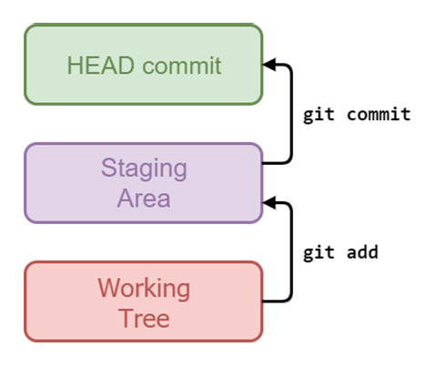
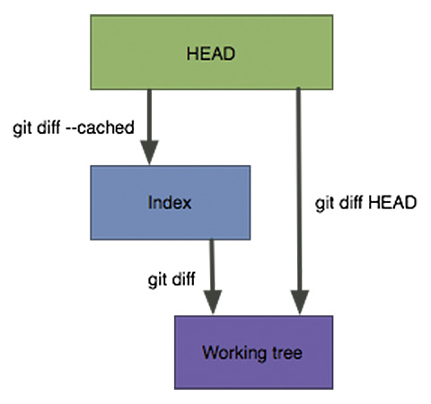
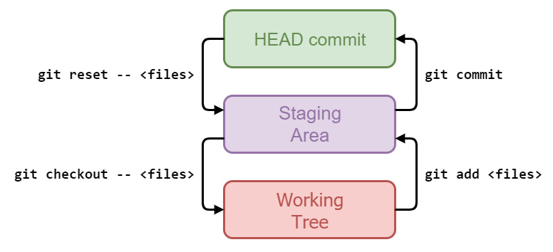

## Introduzione:

Nella scorsa puntata avevamo visto una serie di esempi pratici che illustravano il funzionamento delle tre aree adoperate in Git per la gestione dei file. In questo articolo continuiamo ad approfondire questo argomento, cercando di capire, anche con un po’ di astrazione, il “viaggio” che i file e le loro modifiche fanno attraverso queste aree e i comandi che lo consentono.

### Le tre aree di Git

Come oramai sappiamo, in Git, lavoriamo a tre diversi livelli:

- il **working tree**;
- la **staging area** (o **index**, o **cache**);
- lo **HEAD commit**, ossia l’ultimo commit eseguito sul branch corrente.

Quando modifichiamo un file, lo stiamo facendo a livello di **working tree**; quando facciamo **git add**, stiamo effettivamente copiando le modifiche dal **working tree** alla **staging area**. Alla fine, quando facciamo un **commit**, spostiamo finalmente i cambiamenti dalla **staging** **area** in un nuovo **commit**, a cui fa riferimento **HEAD**, che diventerà parte della storia del nostro repository: questo è ciò che intendo per “**HEAD commit**”. La figura 1 riporta un’immagine esemplificativa con un rappresentazione di queste tre aree.



*Figura 1 – Le tre aree di Git.*

Possiamo spostare i cambiamenti tra queste aree “in avanti”, dal **working tree** verso lo **HEAD commit**, ma possiamo anche andare “all’indietro”, annullando se vogliamo le modifiche effettuate.

Sappiamo già come “andare avanti” usando **git add** e poi **git commit**; diamo un’occhiata ai comandi per “tornare indietro”.

## Rimozione delle modifiche dalla staging area

Nella normale attività quotidiana, può succedere che si aggiungano modifiche alla **staging** **area**, salvo poi accorgersi che le stesse starebbero meglio in un **commit** a parte, e non in quello che si sta componendo in questo momento.

Per rimuovere dalla **staging** **area** tali modifiche a uno o più file è possibile utilizzare il comando **git reset HEAD <file>**; tornate per un attimo nella shell e seguitemi.

Iniziamo controllando di nuovo lo stato del repo:

```
 [27] ~/es03 (master)
 $ git status
 On branch master
 Changes to be committed:
 (use “git reset HEAD <file>...” to unstage)
 modified:   cancelleria.txt
 Changes not staged for commit:
 (use “git add <file>...” to update what will be committed)
 (use “git checkout -- <file>...” to discard changes in working directory)
 modified:   cancelleria.txt
```

Questa è la situazione attuale, ricordate? Abbiamo un **papiro** nella **staging** **area** e una **pergamena** in più nel **working** **tree**.

Proviamo ora a fare quanto appena descritto e digitiamo **git reset HEAD**:

```
 [28] ~/es03 (master)
 $ git reset HEAD
 Unstaged changes after reset:
 M       cancelleria.txt
```

### Modified, Added, Deleted

OK, Git conferma che abbiamo eseguito con successo l’**unstage** delle modifiche, ossia le abbiamo rimosse dalla staging area. La “**M**” sul lato sinistro sta per **Modified**, “modificato”; qui Git in pratica ci sta dicendo che abbiamo appena rimosso dalla **staging** **area** la **modifica** a un file già noto (**tracked**, ricordate?).

Se si crea un nuovo file e lo si aggiunge alla staging area, Git sa che si tratta di un nuovo file; se si facesse l’**unstage**, Git metterebbe a sinistra una “**A**” per **Added**, per ricordarci che si è appena tolta dalla **staging** **area** l’**aggiunta** di un nuovo file.

Stesso se si facesse l’**unstage** della **rimozione** di un file **esistente**: a sinistra, apparirebbe una “**D**” per **Deleted**, vale a dire “eliminato”.

### Modifiche non distruttive

OK, è tempo di verificare cos’è successo:

```
 [29] ~/es03 (master)
 $ git status
 On branch master
 Changes not staged for commit:
 (use “git add <file>...” to update what will be committed)
 (use “git checkout -- <file>...” to discard changes in working directory)
 modified:   cancelleria.txt
 no changes added to commit (use “git add” and/or “git commit -a”)
```

OK, usando il comando **git status** vediamo che ora la **staging area** è vuota, non c’è alcun file “staged”. Abbiamo solo una modifica “unstaged”, ma quale sarà questa modifica? Il **git reset HEAD** ha cancellato il papiro?

Verifichiamo usando il comando **git diff**:

```
 [30] ~/es03 (master)
 $ git diff
 diff --git a/cancelleria.txt b/cancelleria.txt
 index 994cbbf..b1bb2a2 100644
 --- a/cancelleria.txt
 +++ b/cancelleria.txt
 @@ -1,3 +1,5 @@
 penna
 matita
 evidenziatore
 +papiro
 +pergamena
```

No, fortunatamente! Il comando **git reset HEAD** non distrugge le modifiche, ma le rimuove semplicemente dalla staging area, di modo che esse non entrino a far parte del prossimo commit.

Ora che abbiamo esplorato tutti i modi per fare **diff** tra **working** **tree**, **staging** **area** e **HEAD** **commit**, riassumiamo in figura 2 i comandi da utilizzare per eseguire il diff tra le tre aree.



*Figura 2 – I comandi da utilizzare per eseguire il diff tra le differenti aree.*

### Modifiche “distruttive”

Bene, continuiamo con il nostro esempio; le modifiche che abbiamo fatto al file **cancelleria.txt** sono palesemente sbagliate — l’abbiamo fatto di proposito — e quindi abbiamo bisogno di annullarle.

Il comando per compiere questa operazione è **git checkout — <file>**, come Git ci ricorda gentilmente nell’output del comando **git status**:

```
 [31] ~/es03 (master)
 $ git status
 On branch master
 Changes not staged for commit:
 (use “git add <file>...” to update what will be committed)
 (use “git checkout -- <file>...” to discard changes in working directory)
 modified:   cancelleria.txt
 no changes added to commit (use “git add” and/or “git commit -a”)
```

Proviamo quindi ad eseguire **git checkout — cancelleria.txt**:

```
 [32] ~/es03 (master)
 $ git checkout -- cancelleria.txt
```

Nessun messaggio di risposta: siamo di fronte a un altro caso in cui Git non dice niente perché tutto è filato liscio. Ricontrolliamo ora lo stato:

```
 [33] ~/es03 (master)
 $ git status
 On branch master
 nothing to commit, working tree clean
```

OK, siamo in una situazione pulita, niente più modifiche in sospeso. Controlliamo per sicurezza il contenuto del file:

```
 [34] ~/es03 (master)
 $ cat cancelleria.txt
 penna
 matita
 evidenziatore
```

E questo è tutto! Abbiamo effettivamente rimosso **papiro** e **pergamena** dalla lista della cancelleria. Ma attenzione: a questo punto li abbiamo **definitivamente** **persi**! Poiché quelle modifiche erano solo nel **working** **tree** e in nessun precedente **commit**, non c’ è modo di recuperarle, quindi fate attenzione: **git checkout —** è un comando “distruttivo”, e va usato *cum grano salis*.

Oltre a questo, dobbiamo ricordare che **git checkout** sovrascrive anche la staging area; come si vede in figura 2, il **working tree** e l’**HEAD commit** non sono in relazione diretta: i cambiamenti passano sempre attraverso la **staging area**. In seguito torneremo ancora su questo concetto, quando sarà il momento di approfondire le opzioni del comando **git reset**.

## Reset e checkout

A questo punto avrete forse notato che qui abbiamo usato i comandi di **reset** e **checkout** in un modo diverso rispetto a quello che abbiamo fatto nelle puntate precedenti, e in effetti è così.

All’inizio questo può confondere un po’ le idee a chi sta imparando ad utilizzare Git, poiché mentalmente risulta impossibile associare un singolo comando a una singola operazione: lo **stesso** **comando** può essere usato in **modi** **diversi** per fare **cose** **diverse**. Ad esempio, non si può dire: “**git checkout** è il comando per cambiare branch” (oppure per ispezionare un commit, andando in detaching HEAD come abbiamo già visto), in quanto lo stesso comando può essere utilizzato anche per scartare le modifiche nel **working** **tree**, come abbiamo appena fatto.

### L’importanza del doppio trattino —

Il trucco che si può usare per differenziare le due varianti per questi comandi è quello di prendere in considerazione quella notazione del **doppio trattino** (segno **—**). Quindi, si può ricordare che “**git checkout** è il comando per cambiare branch” e “**git checkout —** è per annullare le modifiche locali”.

Lo stesso dicasi per il comando **git reset**.

Il doppio trattino **—** a dire il vero non è obbligatorio; se si fa un **git checkout <file>** o un **git reset <file>** senza **—**, nel 99,99% dei casi Git fa quello che ci si aspetta. Il **doppio trattino** è necessario quando, a causa di una coincidenza, ci sono un file e un branch con lo stesso nome: in questo caso, Git deve sapere se si vuole operare sui branch, e quindi ad esempio passare dal corrente a un altro con **git checkout**, o se si vuole avere a che fare con i file. In questa situazione, il doppio trattino è il modo di dire a Git: “voglio lavorare sui file, non sui branch”.

La figura 3 riassume ora tutti i comandi per spostare le modifiche tra queste tre aree.



*Figura 3 – I comandi per spostare le modifiche tra le tre aree di Git.*

## Conclusioni

Con questo articolo — e con il precedente — dovremmo ormai aver appreso sufficienti competenze sull’utilizzo dei comandi di **checkout**, **reset**, **diff** e **status**, e avere ben in mente come i file e le modifiche ad essi apportate viaggino dalla nostra cartella di lavoro fino a un nuovo commit nel nostro repository, passando per la staging area.

Nel prossimo articolo finiremo di esplorare queste tre aree, andando a vedere in dettaglio come varia lo stato dei file ogni qualvolta eseguiamo un reset o un checkout.

MOLONGUI AUTHORSHIP PLUGIN 5.2.9

https://www.molongui.com/wordpress-plugin-post-authors
