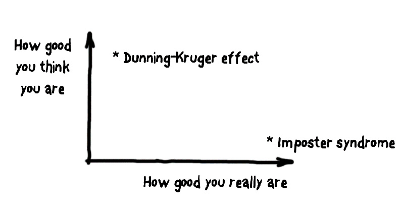
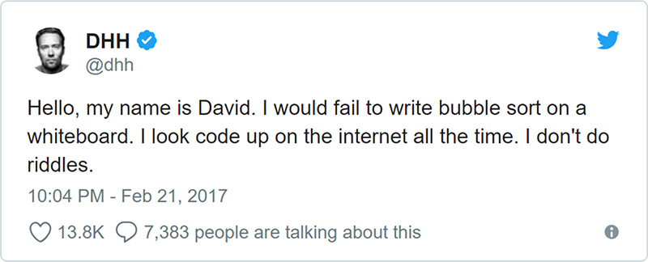
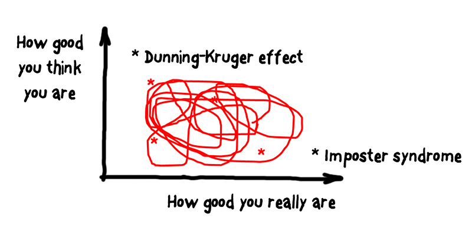
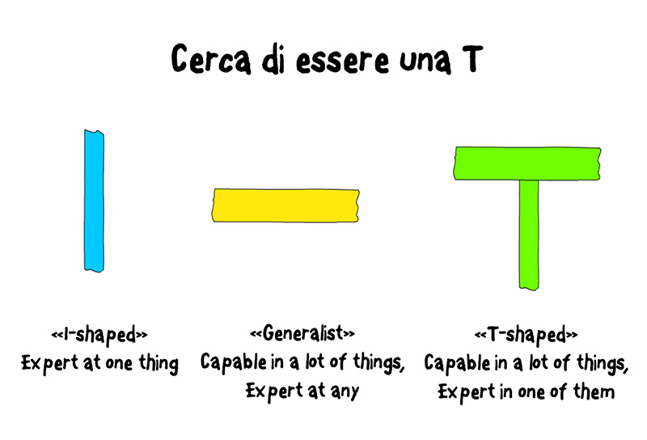
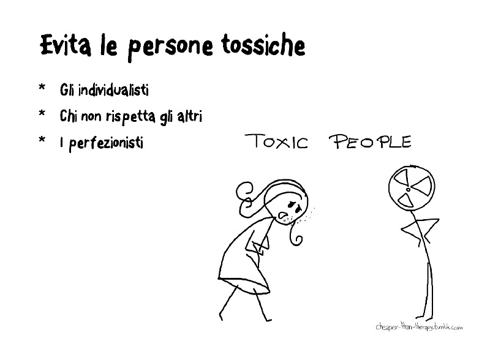

## Mediocre chi?

So già che vi starete chiedendo: perché questo titolo? Facile. Perché questo è ciò che mi ritrovo spesso a pensare, anche se col tempo ho imparato a gestire un po’ meglio questa condizione. E ho scritto questo articolo proprio per condividere con voi quanto scoperto.

Sono nel campo dello **sviluppo software** da vent’anni. Ho lavorato con una **moltitudine** di **tecnologie** e **linguaggi** di programmazione, in diverse aziende, contesti eterogenei e progetti differenti.

A questo punto della mia vita dovrei considerarmi un solido professionista, un *senior* di quelli su cui puoi contare quando le cose si complicano; nonostante il mio biglietto da visita confermi tale versione, credo di avere molti più dubbi oggi di vent’anni fa.

Per cercare di capire meglio quale sia la mia vera natura di sviluppatore, ho deciso di confrontarmi con il pubblico degli **Italian Agile Days 2018** [1] proponendo una sessione in cui raccontare ad alta voce le mie riflessioni e ottenere conferme o smentite da persone che, come me, svolgono il mestiere dello sviluppatore. Per chi fosse interessato, nelle prossime settimane sul sito dello IAD saranno pubblicati anche i video degli interventi.

### Un talk e un articolo

Questo articolo, quindi, è la rielaborazione di quel talk. Quanto detto nel talk, e quanto scriverò qui, è frutto della mia **esperienza** **personale**, e delle **opinioni** che negli anni mi sono fatto. Mi aspetto che a volte **non** siate **d’accordo**, che vi sentiate annoiati o addirittura infastiditi dalle mie parole, ma va bene così: per me è importante stimolare la conversazione e verificare se quanto scoperto trova conferma nell’esperienza di qualcun altro. Vi invito pertanto a mandarmi una mail, un tweet o un qualsiasi altro feedback che vorrete condividere, per raccontarmi il vostro punto di vista in proposito.

Sono due le questioni su cui rifletto da tempo: la mia **mediocrità**, reale o presunta, e il rapporto che ho con le persone con cui mi confronto per lavoro o per passione, soprattutto “**quelli bravi**”.

## Cosa intendo per mediocrità

Intendiamoci: qualche cosa in venti anni l’ho anche imparata… e se incontrate qualche mio amico o collega magari vi dirà pure che sono uno di “quelli che ne sanno”. Non mi ritengo uno sprovveduto: non sono certo un genio, ma so di avere delle qualità.

Eppure, quando si parla di **competenze** **puramente** **tecniche**, sono spesso in affanno, e spesso un generale senso di inadeguatezza prende in me il sopravvento. Cosa mi succede?

Presto detto: mi **dimentico** costantemente le cose più banali, come le **opzioni** dei comandi **Linux** o quelle di **Git**, materia su cui passo addirittura per esperto… Non passa giorno che non mi affidi a **StackOverflow** per avere risposte a semplici problemi di programmazione, come ad esempio come leggere un file da Java.

Ogni volta che leggo Twitter, o una delle innumerevoli fonti da cui traggo informazioni, vedo gente che fa **microservizi** in **Go**, ne effettua il **deployment a caldo** in container **Docker** su cluster **Kubernetes**, mentre io… Non ricordo nemmeno come leggere un file da Java, appunto.

C’è un sacco di roba che non conosco, e molto spesso mi sembra di arretrare, anziché avanzare nell’acquisizione di conoscenze.

### Imparare a lavorare

Eppure c’è stato un tempo in cui pensavo addirittura di essere bravo: mi davano problemi da risolvere, idee da realizzare… e io — con i miei tempi e modi — le portavo a termine.

Da novello diplomato ho avuto l’opportunità di iniziare subito a lavorare, come insegnate tecnico-pratico, nella stessa scuola che mi aveva congedato. La mattina vestivo i panni dell’insegnante, mentre nel resto della giornata — e spesso anche di notte — mi adopravo come “tuttofare”: dal pulire le palline del mouse dei PC in laboratorio, all’allestire reti e server, fino alla realizzazioni di siti web… DevOps *ante litteram*!

La scuola era una di quelle paritarie, il cui direttore aveva la possibilità di scegliersi i collaboratori con maggiore libertà rispetto a una scuola statale; inoltre, nel 1998 non erano ancora state create delle graduatorie per questo genere di figure, e questo mi ha permesso di iniziare quest’avventura nonostante il mio merito fosse solamente quello di essermi guadagnato da studente la stima e la fiducia del direttore.

In quei sette anni ho imparato da zero — e da solo — come costruire un sito web, arrivando in 2-3 anni a realizzare una piattaforma che permettesse ai genitori di vedere voti e assenze dei figli, e agli studenti di vedere argomenti trattati e compiti assegnati in caso di assenza. Ho progettato e condotto corsi per il Fondo Sociale Europeo sullo sviluppo web, sono diventato insegnante certificato ECDL, ho realizzato una piattaforma di e-learning approvata dalla Regione Lombardia…

Se ci penso, ho fatto un sacco di cose. Poi un giorno mi sono reso conto che dovevo prendere una decisione: insegnante o programmatore? Nonostante mi piaccia ancora molto aiutare le persone a crescere e a imparare, la via che ho scelto la conoscete.

Sono quindi approdato in una vera **software house**, con veri **programmatori**, e lì mi sono reso conto di quanto non sapessi nulla di programmazione…

È stato uno shock, positivo col senno di poi, ma ho vissuto momenti di depressione che ricordo ancora. Per fortuna i **colleghi** mi hanno **aiutato** moltissimo, ed è grazie a questa mia prima esperienza da “vero sviluppatore”, durata otto anni, che ho capito effettivamente cosa volesse dire fare questo mestiere.

## Effetto Dunning-Kruger vs. sindrome dell’impostore

Dicevo che a un certo punto mi **sentivo** bravo, ma non lo ero affatto. Qualche anno dopo ho scoperto che questa situazione, questo stato d’animo, ha pure un nome: **effetto Dunning-Kruger**[3].

In buona sostanza, in psicologia è definito effetto Dunning-Kruger quella **distorsione cognitiva** [4] per la quale soggetti con **abilità limitate** si considerano **paradossalmente** **sopra** la **media**. Questo è dovuto al fatto che una persona con scarse conoscenze in una determinata area del sapere è in genere altrettanto **scarsa** nel **giudicare** il suo **livello** di competenza.

Altra situazione divertente — per modo di dire — è invece quella in cui si verifica qualcosa agli antipodi dell’effetto Dunning-Kruger: nonostante tu sia **competente**, ti giudichi **sotto** la **media**, fino a pensare di essere **totalmente** **inadeguato** per il ruolo che ricopri: si tratta della cosiddetta “**sindrome dell’impostore**”. Attenzione: non si tratta di modestia o di un sano bagno di umiltà, bensì di una **condizione psicologica** spesso invalidante, che impedisce a chi ne soffre perfino di apprezzare i risultati positivi raggiunti e di interiorizzare gli effettivi successi, poiché non si è in grado di riconoscere a se stessi il merito di averli raggiunti. In pratica, anche se i propri risultati sono reali e assodati, ci si percepisce come se si stesse ingannando coloro che li riconoscono….

Questi due generi di esperienze posso essere rappresentate in un grafico (figura 1).

*Figura 1 – Effetto Dunning-Kruger e Sindrome dell’impostore come assi di un piano cartesiano.*

Che cosa ha causato in me l’esperienza di queste due condizioni? E, soprattutto, chi ne sono gli artefici?

## Quelli bravi

Riflettendo su questi temi mi sono reso conto che le condizioni sopra descritte sono state quasi sempre generate dal **confronto** che più o meno coscientemente continuo a fare fra me e le persone che reputo capaci, che qui chiamerò “**quelli bravi**”. Con il tempo ho imparato a distinguerne due **famiglie**, alcuni **generi** e diverse **specie**.

Ci sono “**quelli bravi per davvero**”, che si dividono in quelli intelligenti, preparati ma soprattutto **generosi**, e quelli che invece sono più pericolosi di un pesce palla: bravissimi, ma individualisti, impazienti e spesso tossici per un team.

L’altra famiglia invece è quelle dei “**bravi***” — i “bravi con l’asterisco” o “bravi, ma solo perché…” —ossia le persone che non sono necessariamente dotate di un intelletto superiore, o di una vastissima conoscenza di tipo tecnico, ma semplicemente si trovano in una posizione di favore spesso conquistata nel tempo. Parlo di chi è nella stessa azienda — o progetto, o “nicchia” — da diversi lustri, da chi si è fatto la fama di salvatore della patria, da chi lavora 7/24 o da chi ha ricevuto un titolo ed esercita un potere, il più delle volte immeritatamente.

### Affrontare la mediocrità

Ora che ho descritto cosa intendo per “mediocrità” e che ho presentato gli artefici di questa condizione a me così familiare, è giunto il momento di rivelarvi come sto affrontando questa prova. Procediamo per punti.

## Punto 1. A volte sei veramente mediocre, altre volte no: impara a distinguere

Un giorno su Twitter appare questo messaggio di DHH, una persona che gli sviluppatori Ruby conosceranno di certo:

*Figura 2 – David Heinemeier Hansson dichiara apertamente debolezze che non ti aspetti.*

Mi è scattata una molla. Ma come? Uno sviluppatore del suo calibro, uno che ha scritto un framework usato da milioni di programmatori, un imprenditore di successo, ammette di avere carenze che non mi sarei mai aspettato? Non è che magari mi sto facendo più problemi del necessario?

Quando ho letto quel tweet, alcune idee che da tempo mi ronzavano per la testa hanno iniziato a cristallizzarsi. Quelle che credevo mancanze attribuibili a sviluppatori incompetenti erano di colpo diventate qualcosa che caratterizza anche i **professionisti** **migliori**, o perlomeno quelli che nella mia testa lo sono.

Quello degli **algoritmi** di **ordinamento** e del **codice** **scritto** alla **lavagna** è un **classico** nel nostro ambiente; spesso è uno degli ostacoli posti tra un candidato e la sua assunzione alla corte di una “grande azienda”, anche se da un po’ di tempo questo modo di selezionare i membri di un team di sviluppo è diventato oggetto di numerose critiche. Se comunque volete approfondire il tema degli **algoritmi** di **ordinamento**, ho la risorsa giusta [7] per voi

### Le 4 categorie della conoscenza

Torniamo seri, anche se sarà difficile dopo aver visto il video appena indicato… Appurato che avere **carenze** **conoscitive** non è necessariamente un ostacolo al successo, è utile ragionare su quelle che ho definito per semplicità le **4 categorie della conoscenza**:

- cose che so di sapere, o *known knowns*;
- cose che so di non sapere, o *known unknowns*;
- cose che non so di sapere, *unknown knowns*;
- cose che non so di non sapere, *unknown unknowns*.

Facciamo qualche esempio:

- ho la patente da vent’anni, e so guidare un’automobile (**cose che so di sapere**).
- non sono un cardiochirurgo e non saprei eseguire un intervento a cuore aperto per la sostituzione della valvola mitralica (**cose che so di non sapere**).
- Faccio arti marziali sin da piccolo, ma non avevo mai sciato; eppure, nei miei primi tentativi su una pista facilissima, non sono mai caduto e sono riuscito a fare qualche piccola discesa (**cose che non so di sapere**).
- per ovvi motivi… non so farvi un esempio **delle cose che non so di non sapere**…😊

Riflettere su questo modo di **catalogare** il sapere ci permette di comprendere quando siamo vittime dell’effetto **Dunning-Kruger** (*unknown unknowns*) oppure quando si insinua nel nostro cervello il terrore di essere degli impostori (*unknowns knowns*).

La cosa interessante che ho scoperto è che continuo costantemente a muovermi in questo spazio, passando da un estremo all’altro. A volte credo di sapere tutto su una cosa, ma poi mi rendo conto che avevo solo scalfito la superficie; ogni tanto realizzo di avere la capacità di risolvere problemi per cui non pensavo di essere titolato, e altre vengo smentito dal successo quando invece mi ritrovo a dovermi cavare d’impiccio in una situazione che ritenevo troppo complessa per le mie capacità.

Se riprendiamo lo schema di prima, il pattern è quello di figura 3.

*Figura 3 – Un film lungo una vita, che vede protagonista il perenne conflitto tra il finto impostore e l’autentico cialtrone.*

Non ci si può fare niente; il movimento è perpetuo: l’unica cosa possibile è **verificare** a **intervalli** **regolari** la propria posizione, utilizzando qualche piccolo trucco.

### Scegli bene come investire le tue risorse

Una delle prime cose che ho imparato sulla mia pelle è che **non** **puoi** **imparare** **tutto**. Ogni giorno esce qualcosa di nuovo — i programmatori **JavaScript** mi capiranno ancor meglio degli altri… — e stare dietro a tutto è impossibile. Certo, chiudersi a riccio e ignorare il mondo che cambia è la **strategia** **peggiore** per un lavoratore della conoscenza come il programmatore, ma saper scegliere cosa archiviare nel proprio cervello è essenziale.

Con il tempo ho imparato a **selezionare** le cose a più alto **valore “strategico”**: per questo preferisco investire il mio tempo leggendo di **Domain Driven Design** più che di **SpringBoot**, per esempio. Un semplice mantra da ripetersi potrebbe essere “Impara quello che non puoi cercare facilmente su internet”: ricordarsi tutte le opzioni di **JUnit** è buono, ma sapere approcciare una **codebase legacy** vecchia di dieci anni attraverso l’utilizzo di test… è meglio.

Cerco di imparare i **concetti** **fondamentali**, di conoscere le **tecnologie** il **tanto** che **basta** per poterci ritornare nel caso avessi un problema risolvibile tramite esse. Cerco di mantenere leggero il carico in spalla, sapendo che là fuori ho una biblioteca sterminata dalla quale attingere informazioni: l’importante è **sapere** **cosa** **cercare**.

### T-shaped people

Questo modo di intendere la vita, professionale e non, circola da qualche anno [9], ed è entrato prepotentemente a far parte della mentalità degli agilisti: competenze “a forma di T”. Ma che significa?

*Figura 4 – Gli iper-specializzati (competenze “verticali”), i generalisti (competenze “orizzontali”), i professionisti equilibrati (la forma a “T”).*

La figura 4 aiuta a spiegare la metafora. Il primo caso è quello delle competenze “verticali”, ossia essere una “**I**”, una persona super-esperta in una tecnologia o in un particolare ramo, permette di eccellere fino a che il ramo rimane in vita; ma quando si spezza — e noi sappiamo quanto sia rapido il ciclo di vita delle tecnologie — il rischio è quello di rimanere al palo, o peggio ancora, senza lavoro.

Sapere un po’ tutto, ma niente davvero bene bene, è altrettanto controproducente: è il caso delle competenze “orizzontali” rappresentate nell’immagine dalla “**—**”. Ci sono competenze da cui non si può prescindere, e ambiti che richiedono professionisti ferrati. Non avere la padronanza “dei fondamentali”, ad esempio HTTP, HTML, JS e CSS per qualcuno che si vuole posizionare al frontend, rende ardua l’ascesa al successo.

Il giusto compromesso è essere bilanciati: che scoperta! Conoscere vari argomenti in modo accettabile, in modo da cavarsela in una serie di situazioni comuni, e avere poi qualche ambito d’elezione è il modo migliore per fare questo mestiere, nonché l’arma vincente per chi cerca il suo primo impiego o vuole dare una svolta alla sua carriera.

Questo concetto può essere poi applicato anche ad un livello più alto rispetto a quello delle mere competenze tecnologiche; essere un programmatore “a **T**”, e avere tra le proprie attività extralavorative l’improvvisazione teatrale o lo scautismo può, per esempio, risultare la risorsa in più per risolvere questioni professionali che non abbiano come oggetto il codice, ma che sono spesso anche quelle più critiche…

## Punto 2. Non sentirti mediocre a confronto dei bravi*

Tornando alla questione dei “bravi con l’asterisco”, ho imparato a non sentirmi più mediocre anche di fronte a una manifesta inferiorità, se questa è frutto solamente di una posizione di vantaggio. È un po’ come correre i 100 metri con qualcuno che ha 50 o 60 metri di vantaggio: perdo sicuramente, ma questo non vuol dire che io sia oggettivamente meno veloce.

Queste persone sono spesso vittime esse stesse di *bias* e situazioni che in qualche modo li hanno costretti a diventare quel che sono. E, nonostante tutto, sono risorse preziose per chi è appena arrivato in azienda o nel team, in quanto custodi della **tacita** **conoscenza** [10].

Dopo averli prima mitizzati e poi demonizzati, adesso che ho imparato a distinguerli, il mio primo approccio è ora quello di aiutarli; in primis, cercando di renderli consapevoli della situazione e del ruolo che ricoprono e, in secundis, agevolando una loro “disintossicazione” da tutti quei modi di fare che non fanno bene né a loro, né al team e all’azienda per la quale lavorano.

### Comportamenti tipici

Fra questi troviamo i “**silos**”, quelli che detengono la **conoscenza** di un **dominio**, di una **codebase** o di una qualsiasi **risorsa** presente in azienda. In questo caso è necessario lavorare per svuotarli, facilitando la circolazione delle informazioni.

Non è raro incontrare ostilità, più o meno consapevole: quando si percepisce la volontà di mantenere lo status quo, è possibile che ci si trovi davanti ai “guardiani”, a coloro che preservano strenuamente il loro “castello” di conoscenze. In questo caso, i conflitti sono frequenti e, a meno di una “conversione francescana” è necessario chiedere l’aiuto di chi guida l’azienda: queste persone sono infatti una bomba a orologeria.

“Cosa succede se se ne va Tizio? Il programma l’ha fatto lui 17 anni fa, e solo lui sa metterci mano… Se se ne va, chiudiamo baracca…”. Questo potrebbe essere il fumetto sulla testa di qualche amministratore che a un certo punto si trova ostaggio dei suoi stessi dipendenti; impegnatevi per sottolineare situazioni pericolose, e lottate affinché le questioni vengano affrontate.

Ci sono poi gli “**eroi**”, quelli che “lo risolvo io il bug, è troppo complicato per te che non sai che…”. Queste persone hanno in genere un cuore grande, ma prima o poi anche loro cedono, per non dire peggio. Più la questione è critica, è più si rende necessaria la collaborazione di tutti i componenti del team; se la codebase è brutta, sporca e cattiva, se l’applicazione è fonte inesauribile di ticket di assistenza, un modo per domare l’incendio — oltre che scrivere meglio le proprie applicazioni… — è quello di rendere **tutti** **coscienti** di **punti** **deboli**, **stranezze** e **fallacità**, affinché chiunque possa porvi rimedio quando necessario.

E non si creda che lavorare 12 ore al giorno sia la soluzione: in questo caso sono lapidario: **lavorare più del dovuto equivale a barare**.

È come se al 90°, dopo il fischio finale, qualcuno rimanesse in campo con la palla per fare un gol in più e sovvertire il risultato. È appagante risolvere i problemi, e magari fare bella figura agli occhi di qualcuno, ma è scorretto nei confronti di chi magari ha impegni familiari — o una qualunque normalissima vita privata… — e che quindi non può fare altrettanto e guadagnarsi gli allori.

Ci sono poi i “**cow boy fuorilegge**”, quelli che si arrogano il diritto di fare tutto come credono, con pochissime concessioni. L’anzianità di servizio, e magari una più o meno manifesta competenza in un ambito o su un progetto, li porta ad assumere atteggiamenti dannosi per un team, che vanno eradicati. Anche se efficaci nel breve, sono spesso una calamità naturale pronta a radere al suolo anche il migliore dei team.

In ultimo identifico con frequenza, spesso nelle grosse aziende, i soggetti che, forti di un titolo assegnato più o meno meritatamente, si pongono al di sopra del team, pensando di poter imporre soluzioni e strategie senza avere bisogno nemmeno di discuterne. Sono gli analisti, i **team leader**, i solution architect, o tutte quelle figure che dicono cosa fare, ma poi di pratico fanno poco o nulla…

Intendiamoci: c’è chi per un motivo o un altro ricopre questa carica ma non è affatto un problema; penso a tutti quegli sviluppatori con vasta esperienza che il titolo se lo sono guadagnato, e più che imporre soluzioni aiutano il team a scoprire “le migliori tecnologie e architetture” per confezionare il prossimo successo dell’azienda.

Io invece parlo ad esempio di quelle figure imposte da clienti che poi si avvalgono di fornitori esterni, che credono così di tenere le redini di un progetto. Magari qualche volta ha funzionato, ma io ad oggi non ho mai avuto il piacere di assistere a casi folgoranti di successo.

Dopo avervi illustrato alcuni dei soggetti incontrati negli anni, voglio concludere con un consiglio spassionato.

Se le situazioni generate da queste persone non vengono percepite e affrontate; se, per chi guida l’azienda, non sono proprio un problema, anzi, “meno male che c’è Tizio che ci risolve sempre i problemi!” rifletteteci bene: forse è il caso di cambiare azienda.

## Punto 3. Guardati dai “10x developer”

Se frequentate LinkedIn vi sarete sicuramente imbattuti in qualche offerta di lavoro per “**guru**”, “**ninja**” o “**rockstar**” **developer**. A meno che per “**rockstar developer**” non intendiate un conoscitore del linguaggio Rockstar [11], personalmente mi guardo bene da chiunque cerchi o si consideri uno sviluppatore coi superpoteri.

*Figura 5 – Guardati dagli individui “tossici”.*

Questo perché questi soggetti, spesso **bravi per davvero**, hanno in genere la tendenza a essere dei **pessimi** **collaboratori**. È il classico caso del genio sociopatico, di chi arriva a insultare chi non è in grado di tenere il suo passo; un individuo così, seppur talentuoso, va evitato: è un’agente disgregante, e il team finirebbe per dissolversi. Siccome difficilmente ad oggi si fa il mestiere del programmatore senza dovere, ad un certo punto, lavorare con altre persone, ritengo altamente rischioso cedere alla tentazione di assumere il super-esperto di turno, se questo non ha la volontà di collaborare e magari anche aiutare i colleghi a migliorare.

## Punto 4. Quando incontri quelli bravi davvero, non lasciarteli scappare!

Dulcis in fundo, voglio concludere questo mio articolo omaggiando le persone che hanno fatto e continuano a fare di me un programmatore migliore. Parlo di colleghi e amici che oltre ad avere talento, intelletto e qualità d’ogni genere, sono disposti a **condividerle**, per aiutarti a crescere.

Non parlo di “balie”, ma di persone in grado di indossare il “cappello giusto” per occasione, sia quello dell’**istruttore**, quello dell’**allenatore** o quello del **mentore**. Quando incontro questo genere di persone, il mio atteggiamento è oramai assodato: cerco il più possibile di lavorare con loro, di fargli tutte le domande che mi vengono in mente per fugare eventuali dubbi, di confrontarmi senza paura di fare brutte figure. A differenza che con i “10x”, qui nessuno ti giudica.

Mi viene in mente un aneddoto raccontato da Piergiorgio Odifreddi in uno dei suoi podcast [12], che consiglio vivamente. In un episodio, il noto divulgatore racconta delle doti eccezionali che caratterizzavano John Von Neumann[13]. Celeberrimo per le sue “capacità computazionali”, i colleghi fisici e matematici erano soliti rivolgersi a lui quando pensavano di avere un’idea brillante da sviluppare o una tesi inconfutabile; spesso, nel giro di pochi minuti, Von Neumann era in grado di scovare fallacità nei ragionamenti, invalidando studi durati settimane. E fra queste persone che cercavano consiglio figuravano premi Nobel, mica studenti al secondo anno!

Questo aneddoto mi è rimasto impresso perché questa è l’attitudine che perseguo da tempo: quando pensi di avere una buona idea per sviluppare una nuova funzionalità, o quando cerchi di capire come risolvere un bug che ti affligge, cerca il tuo Von Neumann e confrontati con lui. Non sono mai uscito da un confronto di questo genere pensando di avere buttato via il tempo, anzi, trovo il confronto con i migliori una delle vie preferenziali verso la crescita personale.

## Conclusioni

Ho cercato in questo articolo di raccontare esperienze e “lezioni apprese”, senza mai perdere di vista che si tratta di quello che ho vissuto e sistematizzato in prima persona: non pretendo in alcun modo di dettare delle regole universali, ma mi farebbe piacere se almeno qualcuna delle mie riflessioni potesse fungere da spunto per il percorso personale di qualche sviluppatore.

Come avrete capito, ad ogni modo, per quanto studio e applicazione richiedano sicuramente un impegno in prima persona, questo mestiere deve liberarsi da un approccio individualista. Per questo voglio congedarmi con questo pensiero: “Sii il peggior giocatore nella miglior squadra che accetti di farti giocare”.

MOLONGUI AUTHORSHIP PLUGIN 5.2.9

https://www.molongui.com/wordpress-plugin-post-authors
