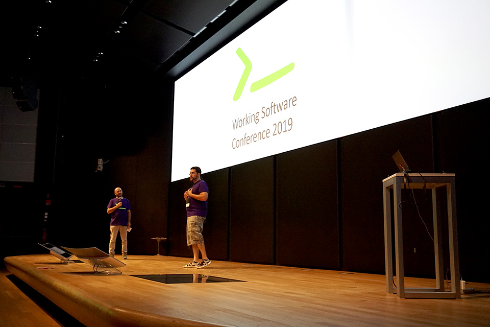
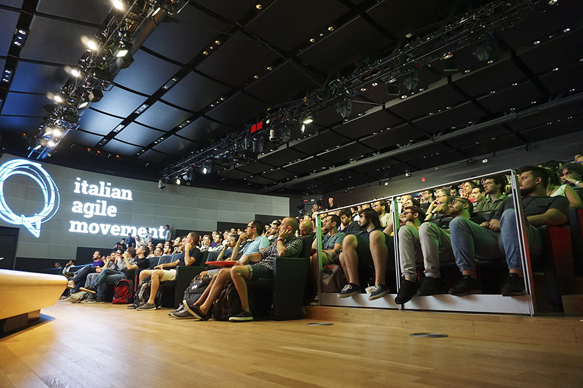
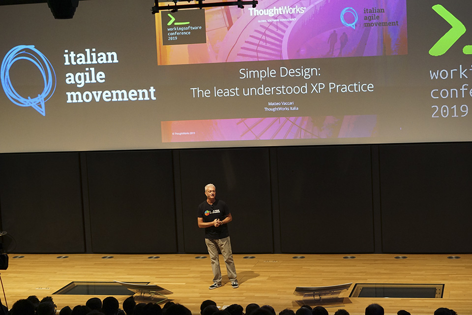
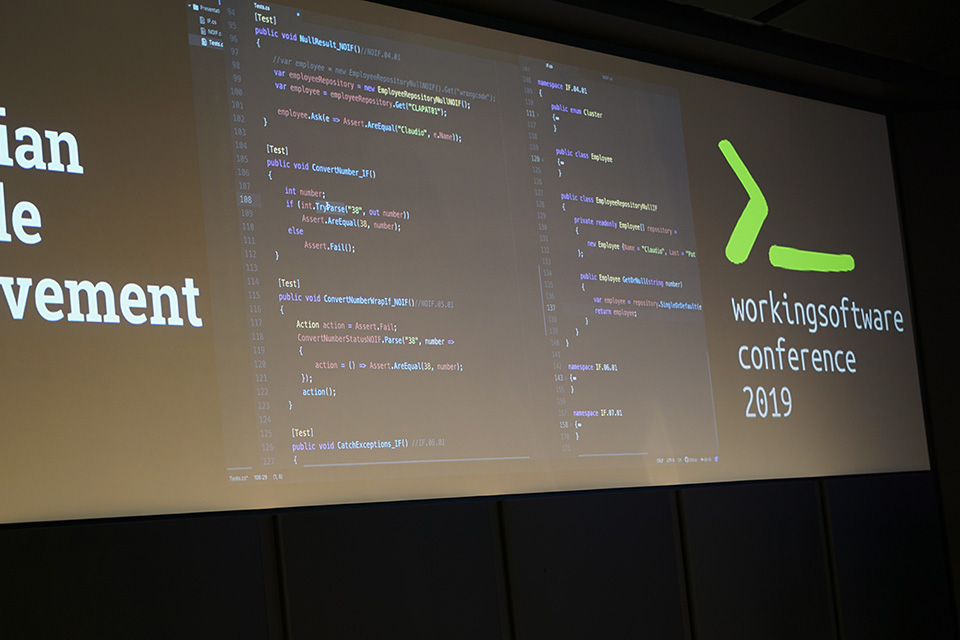
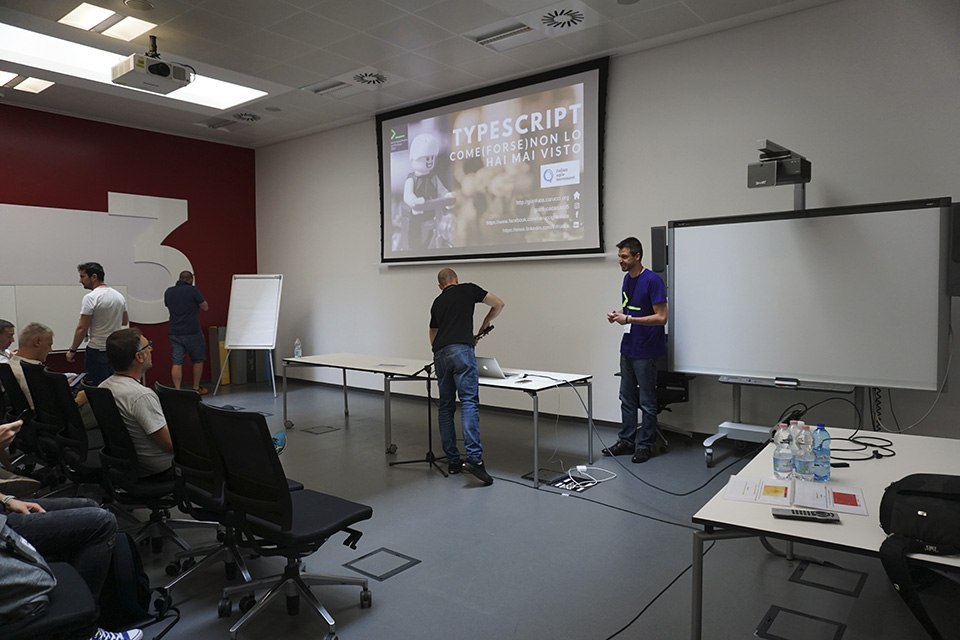
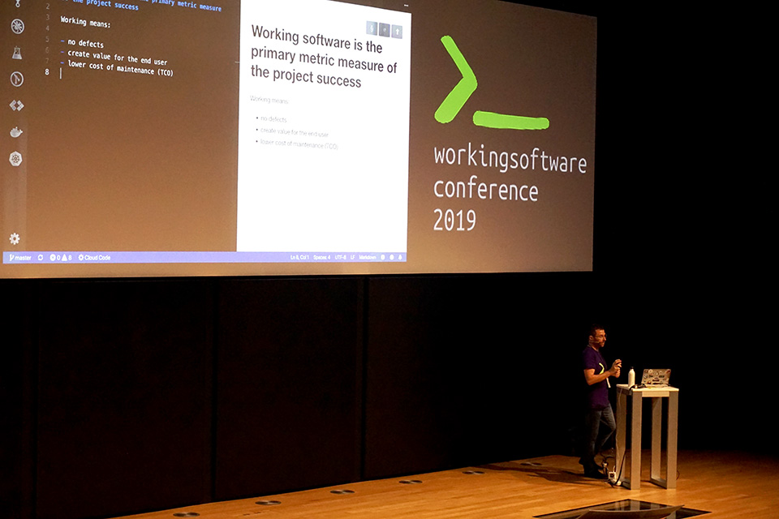

## Ancora un’altra conferenza?

Conformandoci a quello che si è soliti fare al giorno d’oggi, partiamo subito mettendo le mani avanti e quindi… *Disclaimer*: chi scrive ha partecipato alla organizzazione e alla preparazione della conferenza, ma non è intervenuto proponendo contenuti. Racconterò pertanto le mie impressioni da *embedded*, cercando però di essere quanto più obiettivo possibile e non nascondendo anche alcune piccole criticità che sicuramente possono essere migliorate.

Ma, fatta questa doverosa premessa di **trasparenza**, voglio cominciare questo articolo spiegando perché siamo andati a complicarci ulteriormente la vita… organizzando un’altra conferenza, quasi che non ce ne fossero abbastanza.

### Che cosa è Working Software Conference

**Working Software** [1] è una conferenza a partecipazione gratuita, che dura una giornata e rientra tra gli **eventi** promossi dall’Italian Agile Movement [2]. Si è svolta lo scorso 3 luglio presso il Vodafone Theatre [3] nel quartiere Lorenteggio di Milano, una location notevole per gli spazi e la tipologia degli ambienti.

### I perché della Working Software

Uno sguardo all’attuale panorama dell’Agilità, specie in Italia, ci ha convinti che organizzare un’ulteriore conferenza poteva essere una buona idea, visto il **taglio peculiare** che avremmo dato all’evento. Si trattava, in effetti, di andare a colmare un vuoto creatosi in questi ultimi anni che hanno visto una significativa diffusione delle tematiche “agili” all’interno delle aziende, ma spesso con un’attenzione quasi esclusivamente legata ai pur importanti aspetti organizzativi e di dinamica di gruppo e ai processi di trasformazione aziendale.

Pertanto, in un panorama in cui i **principi** e le **pratiche** **agili** si estendono sempre più a contesti “non software”, la conferenza Working Software avrebbe rappresentato un punto di riferimento per quelle situazioni in cui ancora “Il **software funzionante** è il principale metro di misura di progresso” [4].

C’era il forte desiderio di riportare i **programmatori** a partecipare alle conferenze IAM come gli Italian Agile Days: avevamo infatti notato che a tali eventi ormai non partecipassero più molti degli **sviluppatori** che hanno aderito al **Manifesto Agile** fin dagli inizi, ma che poi non hanno seguito l’evoluzione in senso di agile coaching e agile management e hanno continuato a fare principalmente i **programmatori**.

*Figura 1 – Questa nuova conferenza ha un target preciso: programmatori che adottano principi agili e che vogliono continuare a sviluppare software.*

Queste persone lavorano spesso in contesti che sono di fatto agili pur senza l’adozione di una vera e propria metodologia strutturata: rilascio continuo di valore per il cliente, prodotti funzionanti, cicli di sviluppo iterativi e incrementali con scadenze brevi e precise per nuove *release*, piccoli team autoorganizzati e orientati ai risultati.

Queste persone, che non sono certo poche, continuano a essere primariamente interessate agli aspetti dello **sviluppo** **software** e delle **pratiche** **tecniche** che, negli ultimi anni, sono spesso passati in secondo piano nelle molte “conferenze agili” che si tengono con regolarità. E in questo senso, **Working Software** voleva rivolgersi primariamente proprio a loro.

## Lo svolgimento

Evidentemente la necessità da colmare non era solo una nostra immaginazione, ma corrispondeva a una reale “lacuna” nel panorama delle conferenze agili del nostro Paese. Alla fine abbiamo avuto 433 iscritti e il tetto di chi ha partecipato effettivamente ha superato le 300 unità, con un *drop rate* in linea con gli eventi gratuiti di questo genere.

*Figura 2 – Una notevole presenza di pubblico e una location adeguata hanno contraddistinto questa prima edizione della conferenza Working Software.*

Aggiungiamo poi che sono state presentate ben 72 proposte tra **talk** e **workshop**, tra le quali è stato difficile dover scegliere solo le 18+6 accettate.

### Talk e workshop

La Working Software conference si è aperta con il keynote, in cui Matteo Vaccari ha passato in rassegna le **pratiche** **tecniche** dell’**eXtreme Programming** concentrandosi in particolare sul **Simple Design** e illustrando cosa significhi “semplice” in questo contesto.

*Figura 3 – Il keynote iniziale, tenuto da Matteo Vaccari.*

Successivamente, il programma si è svolto su ben sei “binari” paralleli: tre track dedicate ai talk “frontali” e tre track riservate ai workshop, con sessioni diverse al mattino e al pomeriggio per un totale di 6 workshop.

Per quanto riguarda i talk va subito specificato che molte presentazioni hanno offerto momenti di **live coding** proprio nello spirito della conferenza, che prevedeva per quanto possibile un **taglio pratico**, con poche slide e molto codice.

*Figura 4 – La modalità live coding è stata dominante.*

### Possibili miglioramenti

Non è mancato anche qualche **problema**, per esempio di tipo tecnico con delle difficoltà relative ai collegamenti con i proiettori nelle sale delle track. E ci sono poi delle considerazioni da fare sull’intenzione di **internazionalizzare** una conferenza come questa: da un lato, si è cercato di far sì che ogni track di presentazioni avesse almeno un intervento in **lingua inglese**; dall’altro si è notato che la partecipazione di svilupptori stranieri era comunque minima e si dovrà valutare se sia effettivamente questa la strada da percorrere, tenuta presente la **specificità** **italiana** dello Italian Agile Movement.

Altra area su cui intervenire è quella dei **workshop**: sappiamo quanto siano importanti, al punto che in certe conferenze essi diventano il nodo focale di tutto l’evento. Ma in questo caso ci ha colpito il fatto che svariati partecipanti, inizialmente iscrittisi a qualche workshop, abbiano poi preferito prendere parte ai diversi talk. Forse hanno preferito la varietà delle diverse presentazioni all’approfondimento monotematico del workshop, ma di fatto ciò ci ha fornito materiale per una riflessione e per cercare di migliorare anche su questo settore.

### Final raffle

Oltre ai vari momenti di pausa caffè, che poi diventano occasioni per fare rete, discutere, scambiare contatti, abbiamo organizzato prima della conclusione vera e propria, una **lotteria finale** con premi, anche di valore consistente, messi a disposizione dagli sponsor: si è trattato di un modo divertente e inusuale con cui sottolineare l’apporto fondamentale degli sponsor evitando la classica litania delle citazioni. Nel concreto, a vari fortunati partecipanti è andata una trentina di premi estratta a sorte.

## I temi: linguaggi, strumenti, pratiche

Come detto, la **Working Software conference** è stata dedicata ai temi dell’eccellenza tecnica, dello sviluppo software nel contesto Agile, delle buone pratiche di sviluppo, dei linguaggi e delle architetture.

Pur nella varietà delle proposte, qualche argomento è tornato più volte nei talk e nei workshop, a dimostrazione del fatto che alcuni temi sono particolarmente sentiti e attuali. Chiaramente, nel nostro dare un breve resoconto su alcuni interventi, ci limitiamo a quelli ai quali abbiamo potuto assistere, senza alcun criterio di preferenza: tutti i relatori meriterebbero una citazione, ovviamente.

### Linguaggi

Per quel che riguarda l’ambito dei **linguaggi**, ci sono stati alcuni argomenti su cui si è maggiormente concentrata l’attenzione, e tra questi vi è sicuramente quello dei linguaggi di programmazione orientati ai **sistemi distribuiti**.

Gianluca Padovani ha presentato un talk dal titolo *DDD loves Actor Model and Actor Model loves Elixir*, dal quale emergeva la potenza e l’efficacia di un linguaggio come **Elixir** [5] per scrivere software adatto a scenari DDD, CQRS ed ES grazie all’Actor Model integrato nella sua Virtual Machine.

L’argomento **Elixir** è tornato anche nel talk di Nicola Fiorillo, intitolato *Nella mente di un alchimista*: anche qui si è puntato a illustrare le differenze, anche **concettuali**, che esistono fra Elixir e i paradigmi di programmazione più classici.

Altri linguaggi hanno catturato l’attenzione dei relatori e tra questi ci sono sicuramente **Kotlin** [6] e **TypeScript** [7].

*Figura 5 – Typescript è stato uno dei linguaggi di cui si è parlato.*

Dario Coletto ha parlato di *Kotlin Multiplatform: The real “write once, run anywhere”*, un progetto per creare la possibilità di scrivere con Kotlin del codice **realmente multipiattaforma** che poi viene compilato per i diversi sistemi (Android, iOS, web, Windows/Linux/Mac OS nativi e così via).

In *TypeScript come (forse) non lo avete mai visto*, Gianluca Carucci ha svolto una panoramica con esempi di codice sul linguaggio TypeScript, mettendo in luce in particolare il **passaggio** da paradigma **OOP** a linguaggio **funzionale** che esso consente.

### Strumenti

Accanto al tema dei linguaggi, un certo interesse ha suscitato anche la componente “strumenti”: quali **tool**, quali **ambienti**, quali catene di strumenti possono facilitare il compito dello sviluppatore e consentire una riduzione degli sprechi e un conseguente miglioramento della qualità del software? Quali novità reali si intravvedono all’orizzonte?

Un quadro d’insieme sui **tool** che possono essere usati per valutare la **qualità del codice** ha costituito l’intervento di Thomas Rossetto dal titolo *QCT fantastici e dove trovarli*: quali Quality Check Tools si sono dimostrati validi nell’esperienza concreta? In che modo la tool chain scelta si colloca in un contesto di Continuous Integration?

In *Quarkus 101: First (blazing fast) steps*, Giuseppe Bonocore ha fatto un’introduzione al nuovo Java stack orientato ai microservizi realizzato da Red Hat [8]. Si è trattato di una demo con live coding che ha messo in luce le **prestazioni** davvero notevoli di Quarkus: un “rilancio” per il codice **Java** che con questo strumento riesce a raggiungere prestazioni davvero impensabili fino a poco tempo fa.

### Pratiche

Chiaramente la conoscenza di linguaggi e l’utilizzo di strumenti deve concretizzarsi in **pratiche** di sviluppo software e diversi sono stati gli interventi che si sono focalizzati sui **test**, sulle **revisioni** del **codice** o su una serie di buone pratiche derivate dall’esperienza.

Stefano Magni, ad esempio, in *Mastering UI testing* si è concentrato sulla scrittura di **test** per le **interfacce** **utente** **web**. L’uso adeguato di strumenti come Cypress [9] e un approccio Test Driven Development alle UI aiutano a scrivere e manutenere in maniera efficace la propria batteria di test per le interfacce, riducendo errori e migliorando il flusso del processo di produzione.

*7 buone abitudini per scrivere software funzionante* è stato invece il talk in cui Giulio Roggero, attingendo alle sue esperienze, ha proposto una serie di **buone** **pratiche** per scrivere codice di qualità, mostrando in diretta certi concetti attraverso esempi in live coding.

*Figura 6 – Un panorama “live” delle buone pratiche per scrivere codice di qualità è stata presentata da Giulio Roggero.*

Affinché sia veramente **working software**, non basta che un insieme di righe di codice in qualche modo funzioni: occorre che il codice sia facile da manutenere, che sia in grado di “autoripararsi”, che l’automazione sia presente fin dall’inizio e che si prenda atto che il design non è mai definitivo (**evolutionary design**). Occorre conoscere bene la tecnologia, ma anche creasi delle buone abitudini per utilizzare al meglio la tecnologia conosciuta.

Questo rapido riassunto di alcune proposte ha voluto avere solo un intento “dimostrativo”: sicuramente altri partecipanti avranno seguito altre presentazioni — o workshop — e saranno rimasti particolarmente colpiti da proposte diverse.

## Sviluppare

Da buoni sviluppatori… adesso si tratta di sviluppare. Da un lato c’è la soddisfazione di aver contribuito a realizzare un evento in grado di intercettare l’interesse e le necessità di molti: ce ne ha fornito riscontro la presenza di “agilisti” della prima ora che, negli ultimi anni, non si vedevano più alle conferenze più orientate all’adozione dell’agilità in contesti business e manageriali. E anche in termini di partecipazione assoluta ci possiamo dichiarare soddisfatti.

D’altro canto, per una prossima edizione, occorrerà valutare con oculatezza il tipo di bilanciamento tra talk e workshop, cercando di coinvolgere ancora più persone fin dalla fase di call for speakers e di organizzazione preliminare.

MOLONGUI AUTHORSHIP PLUGIN 5.2.9

https://www.molongui.com/wordpress-plugin-post-authors
